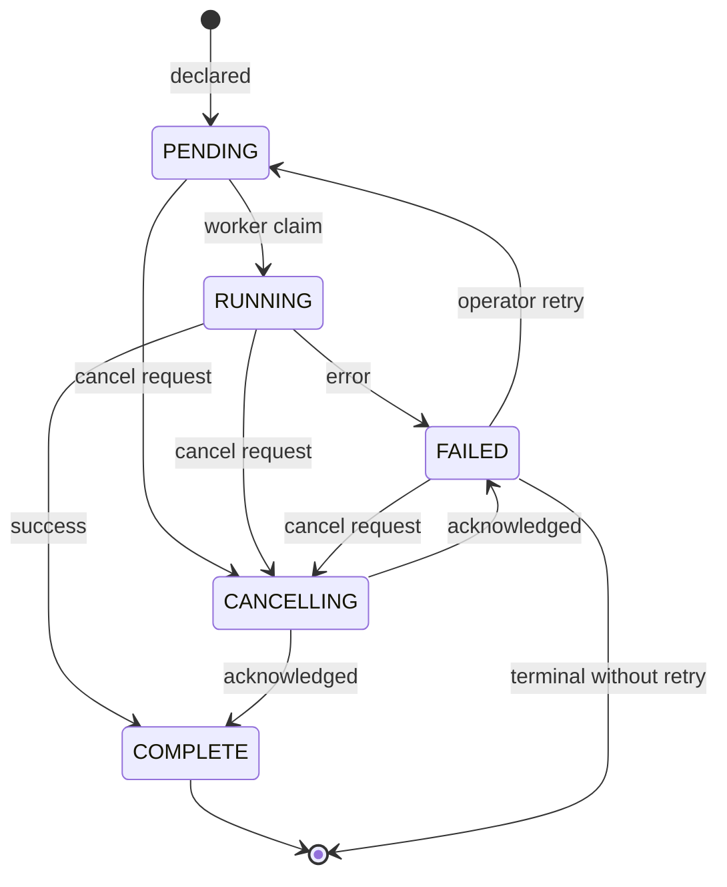

# Database Management

**Product:** TheOracleRPC
**Codename:** Unity

**Spec document — `docs/database_management.md`**
**Status:** authoritative reference for the Maintenance/Management axis of the Database subsystem.

---

## 1. Purpose and scope

This document specifies the Maintenance/Management axis of the
Database subsystem as it exists in v1.0.0: the `service_tasks_ddl`
table, the three enum types governing task state and semantics, the
declaration surface on `DatabaseMaintenanceModule`, the worker's
poll/claim/dispatch mechanics, and drainstop coordination.

The Operations axis (`DatabaseOperationsModule` and its named-op
registry) is out of scope; see `kernel_architecture.md` §7. The
Manager/Executor/Provider pattern that this axis instantiates is in
`kernel_architecture.md`, and provider-layer composition mechanics
are in `provider_composition.md`. Module lifecycle mechanics are in
`module_lifecycle.md`.

Application-tier workflow orchestration, scheduled tasks, and async
task tracking are core-tier concerns and not covered here.

---

## 2. Why this axis has a queue

Schema changes are rare, destructive, must be serialized against
themselves, and must be auditable after the fact. In-process method
dispatch satisfies none of these requirements. The queue gives five
properties that together make DDL dispatch safe:

- **No races.** The maintenance manager and the management executor
  never hold shared in-process state. Concurrent declarations
  serialize through the table's insert order.
- **Controlled cadence.** The management executor runs only as often
  as its poll interval allows. Nothing in application code can force
  an immediate DDL application.
- **Restart safety.** Pending tasks persist across restarts; tasks
  in progress either complete or are re-picked on next boot via
  stale-claim recovery.
- **Auditability.** Every privileged decision is a row with status,
  timestamps, and originating-module reference before it runs.
- **Multi-node safety.** When Unity runs on more than one node, the
  table is the coordination point. Nodes do not negotiate ownership
  in-memory; the row's status column and the database's own
  concurrency controls arbitrate.

Beyond the five, DDL carries an additional concern specific to
correctness rather than safety: a partially applied schema change is
a worse failure state than a delayed one. Queue-mediated dispatch
makes delay the default rather than in-process pressure.

---

## 3. The `service_tasks_ddl` table

The table is created by the v1.0.0 foundation migration and seeded
with enum values by the v1.0.0 seed migration. This document
describes the columns in prose; full DDL lives in
`migrations/v1.0.0_foundation.sql`.

Key columns and their roles:

- **`key_guid`** — deterministic task identifier, computed as
  `uuid5(NS_HASH, "service_tasks_ddl:{operation}.{target}")`.
  Re-declaring the same operation against the same target hits the
  same row. This is the idempotency substrate: a module that
  declares "create_index on `ix_foo_bar`" twice produces one row,
  not two.
- **`ref_status_enum_guid`** — FK into `service_enums` filtered to
  `pub_enum_type = 'task_status'`. Current value drives the state
  machine; see §4.
- **`ref_operation_enum_guid`** — FK into `service_enums` filtered
  to `pub_enum_type = 'task_operation_ddl'`. Identifies which DDL
  method on `DatabaseManagementProvider` applies this task; see §5.
- **`ref_disposition_enum_guid`** — FK into `service_enums`
  filtered to `pub_enum_type = 'task_disposition'`. Classifies the
  task's reversal semantics; see §6.
- **`ref_declared_by_module_guid`** — FK into
  `service_modules_manifest` identifying the module that originated
  the declaration. Nullable for declarations outside a registered
  module (operator-initiated DDL, bootstrap paths).
- **`pub_spec`** — JSON specification. Shape varies per operation;
  see §5.
- **`pub_requires_drain`** — when set, the worker must coordinate a
  quiescence with `DatabaseMaintenanceModule` before running the
  task. See §8.7.
- **`pub_attempts`** — invocation counter, incremented on claim.
- **`priv_started_on`**, **`priv_completed_on`**, **`priv_error`** —
  execution audit fields.

---

## 4. Task status lifecycle

The `task_status` enum defines five values and the worker drives
their transitions.



The worker performs three transitions automatically: `PENDING →
RUNNING` on claim, `RUNNING → COMPLETE` on success, and `RUNNING →
FAILED` on error. The worker also performs `RUNNING → PENDING` via
stale-claim recovery at startup; see §8.5.

Cancellation initiation and retry are operator-driven. `CANCELLING`
is a transitional state — the consumer (the worker or a future
external actor) acknowledges the request by transitioning to
`FAILED` or `COMPLETE` depending on whether the cancellation
succeeded before work completed.

---

## 5. Operations

The `task_operation_ddl` enum defines the five DDL operations v1.0.0
supports. Each maps directly to a method on
`DatabaseManagementProvider`:

| Operation | Provider method | `pub_spec` contents |
|---|---|---|
| `CREATE_TABLE` | `create_table(spec)` | Full table definition: columns, types, constraints. |
| `ALTER_COLUMN` | `alter_column(table, spec)` | Table identifier and target column definition. |
| `CREATE_INDEX` | `create_index(spec)` | Table, index name, column membership, uniqueness. |
| `DROP_CONSTRAINT` | `drop_constraint(table, name)` | Table and constraint name. |
| `DROP_INDEX` | `drop_index(table, name)` | Table and index name. |

Dispatch from operation enum value to provider method is a static
mapping — a `match` statement in the worker's `_dispatch`. Adding
an operation means adding an enum value, a provider method, and a
branch in the worker. There is no runtime lookup, no reflection,
and no dynamic registration; the operation set is fixed in code and
classified in data.

---

## 6. Dispositions

The `task_disposition` enum defines four values that classify the
reversal semantics of a task:

- **`REVERSIBLE`** — task effect can be undone via a compensating
  task. The compensation itself is declared separately if and when
  needed; the disposition marks eligibility, not mechanism.
- **`IRREVERSIBLE`** — task effect cannot be undone through the
  system. Failure is logged with additional prominence; external
  recovery is the only remediation.
- **`TRANSIENT`** — task has no persistent effect; safe to discard
  mid-execution.
- **`CANCELLABLE`** — task may be cancelled before or during
  execution without a compensating task.

The worker uses disposition only for logging and to inform operator
decisions. v1.0.0 does not implement automatic rollback — declaring
a task as `REVERSIBLE` does not cause the system to issue a
compensating task on failure, only to flag the task as a candidate
for one.

Declarers classify operations by default as follows, though the
declarer may override when the specific `spec` warrants a different
classification:

- `CREATE_TABLE`, `CREATE_INDEX` → `REVERSIBLE`
- `ALTER_COLUMN` → `REVERSIBLE` for widening; `IRREVERSIBLE` for
  narrowing with data loss
- `DROP_CONSTRAINT`, `DROP_INDEX` → `IRREVERSIBLE` unless the
  declaration captured the full definition for reinstatement

---

## 7. Declaration surface (`DatabaseMaintenanceModule`)

The module exposes the public API application code calls to declare
DDL work. The current code carries provisional stubs; the
signatures in the current module predate the enum-GUID design and
need realignment.

**Target shape:**

```
declare_ddl_task(
  operation: str,
  target: str,
  spec: dict,
  disposition: str,
  requires_drain: bool = False
) -> UUID
```

Behavior:

1. Resolves `operation` and `disposition` names to their
   `service_enums` GUIDs.
2. Computes the task GUID via
   `uuid5(NS_HASH, f"service_tasks_ddl:{operation}.{target}")`.
3. Upserts the row with `PENDING` status. If a row with that GUID
   exists, updates `pub_spec`, `pub_requires_drain`, and
   `ref_disposition_enum_guid`, and resets status to `PENDING`. This
   lets a re-declaration supersede an earlier version of the same
   logical change.
4. Returns the task GUID.

Named higher-level helpers on the module — `reconcile_schema()`,
`reindex(table)`, `update_statistics(table)`, `snapshot_schema()` —
compose one or more `declare_ddl_task` calls to effect a logical
operation. `reconcile_schema` is the primary entry point: it walks
declared schema (`objects_schema_*`) against live schema (via the
management provider's introspection methods) and emits the DDL task
declarations necessary to bring live into alignment with declared.

---

## 8. Worker mechanics (`DatabaseManagementWorker`)

### 8.1 Startup

The worker's `start()` creates the monitor task. The task's first
action is `await self._module_manager.on_sealed()` — it does not
run any work until the full module graph has completed Phase 3.
Once unparked, the worker runs `recover_stale_claims()` once to
reset any tasks left in `RUNNING` by a prior crash, then enters the
outer poll loop.

### 8.2 Outer poll loop

Cadence is driven by `TaskDdlPollRate`, read from
`system_configuration` during `DatabaseManagementModule.startup()`
and passed to the worker's constructor. Each iteration calls
`_drain_pending`, then either sleeps for the poll interval or exits
on the stop event. Draining before sleeping means cadence applies
only when the queue is empty — backlog processes at full speed.

### 8.3 `_drain_pending`

Calls `claim_next_task` in a tight loop until it returns `None`.
Each claim is atomic at the provider layer. This is the mechanism by
which a backlog clears without waiting for the next poll tick.

### 8.4 `_dispatch`

For each claimed task, `_dispatch` maps `claim.operation` to the
corresponding provider method via a static `match`, invokes it with
`claim.spec`, and records the outcome:

- On success: `mark_task_completed(key_guid, result=None)`.
- On failure: `mark_task_failed(key_guid, error=str(exception))`.

No automatic retry. A failed task stays `FAILED` until an operator
transitions it back to `PENDING`.

### 8.5 Stale claim recovery

`recover_stale_claims()` runs once at the top of the monitor loop,
after the manager-sealed wait. Stale means `RUNNING` with
`priv_started_on` older than `TaskDdlStaleGraceSeconds`. Such tasks
are transitioned back to `PENDING` so the next poll iteration
re-picks them. Returns the count recovered; logged only if non-zero.

### 8.6 Multi-node coordination

Atomic claim at the provider layer is the only coordination point.
No in-process heartbeats; no node identity tracking. The
stale-recovery grace period serves as the effective heartbeat
timeout — a node that crashes mid-dispatch releases its claimed
tasks to the pool after `TaskDdlStaleGraceSeconds`.

### 8.7 Drain-required tasks

Tasks with `pub_requires_drain = 1` require
`DatabaseMaintenanceModule` to quiesce its declaration surface
before the worker runs them. The design intent is that the worker,
on claiming such a task, signals maintenance to quiesce; maintenance
acknowledges when no new declarations are in flight; the worker
proceeds. v1.0.0 does not implement this protocol — the worker
processes drain-required tasks the same as any other. Full
implementation is deferred; the column exists so that declarations
needing this property can be marked correctly now and honored when
the protocol lands.

---

## 9. Shutdown coordination

`DatabaseManagementModule.on_drain()` calls `worker.stop()`. The
worker sets its stop event and awaits the current `_drain_pending`
iteration's in-flight `_dispatch` to complete. No task is
interrupted mid-execution. Tasks that had not been claimed remain
`PENDING` and are eligible for pickup on next boot.

`DatabaseManagementModule.shutdown()` clears the worker and provider
references. The queue table is untouched; nothing is cleaned up.
This is correct — the queue is durable state, not module state.

---

## 10. Provider queue-operation contract

`DatabaseManagementProvider` exposes four queue methods that the
worker calls. Implementations are engine-specific; the query
definitions themselves are out of scope for this document and will
be defined elsewhere.

- **`claim_next_task() -> DdlTaskClaim | None`** — atomically
  selects one `PENDING` task and transitions it to `RUNNING`,
  stamping `priv_started_on` and incrementing `pub_attempts`.
  Returns the claim shape or `None` if no tasks are pending. The
  atomicity is required for multi-node safety.
- **`mark_task_completed(key_guid, result=None) -> bool`** —
  transitions `RUNNING → COMPLETE`, stamps `priv_completed_on`.
- **`mark_task_failed(key_guid, error) -> bool`** — transitions
  `RUNNING → FAILED`, records `priv_error`.
- **`recover_stale_claims() -> int`** — transitions `RUNNING` tasks
  older than `TaskDdlStaleGraceSeconds` back to `PENDING`. Returns
  the count recovered.

The worker does not issue SQL directly against `service_tasks_ddl`.
All queue state changes go through these four methods.

---

## 11. `DdlTaskClaim` shape

The dataclass the provider returns from `claim_next_task` and the
worker consumes in `_dispatch`. Current code carries placeholder
field names that predate the table's final column design; the
target shape is:

| Field | Type | Source |
|---|---|---|
| `key_guid` | `UUID` | task's deterministic GUID |
| `operation` | `str` | operation enum `pub_name` |
| `disposition` | `str` | disposition enum `pub_name` |
| `spec` | `dict` | parsed `pub_spec` JSON |
| `attempts` | `int` | post-claim `pub_attempts` value |
| `requires_drain` | `bool` | `pub_requires_drain` |

The provider resolves the operation and disposition FKs to their
`pub_name` strings when building the claim, so the worker's
`_dispatch` match statement reads human-readable names. GUIDs stay
in the database; names flow through the worker.

---

## 12. Configuration

The axis uses two `system_configuration` keys:

- **`TaskDdlPollRate`** — seconds between poll iterations when the
  queue is empty. Default `5.0`. Read by
  `DatabaseManagementModule.startup()` and passed to the worker's
  constructor.
- **`TaskDdlStaleGraceSeconds`** — grace period before a `RUNNING`
  task is considered stale and eligible for recovery. Default to be
  chosen at implementation time.

Both keys are seeded by the module's seed package when the install-
seed pattern is implemented.

---

## 13. Bootstrap and installation

The v1.0.0 foundation migration creates `service_tasks_ddl`, the
three enum types in `service_enums`, and the supporting tables
(`service_modules_manifest`, the `objects_schema_*` family,
`system_configuration`). The v1.0.0 seed migration populates the
enum values.

This is a bootstrap path — direct DDL executed outside the queue —
because the queue itself is one of the things being created. Once
the foundation is installed, subsequent DDL is declared through the
queue.

The management provider's DDL emission methods cannot execute until
after the connection pool is open and the provider is composed. The
provider's role is exclusively post-bootstrap; the foundation
migration runs as a `.sql` file, not through the provider.

---

## 14. Implementation status

| Component | Status |
|---|---|
| `service_tasks_ddl` table | Implemented (v1.0.0_foundation.sql) |
| `task_status`, `task_operation_ddl`, `task_disposition` enums | Implemented (v1.0.0_seed.sql) |
| `service_modules_manifest` table | Implemented (v1.0.0_foundation.sql) |
| `DatabaseManagementProvider` queue-operation ABC | Implemented |
| `MssqlManagementProvider` queue-operation methods | Stubs |
| `DatabaseManagementProvider` DDL emission ABC | Implemented |
| `MssqlManagementProvider` DDL emission methods | Stubs |
| `DatabaseManagementProvider` introspection ABC | Implemented |
| `MssqlManagementProvider` introspection methods | Stubs |
| `DatabaseManagementWorker` loop structure | Implemented |
| `DatabaseManagementWorker._dispatch` body | Stub; spec in §8.4 |
| `DatabaseMaintenanceModule.declare_ddl_task` | Partial; signature needs realignment per §7 |
| `DatabaseMaintenanceModule` named helpers | Stubs |
| `DdlTaskClaim` dataclass shape | Partial; field alignment per §11 |
| Drain-required task coordination (`pub_requires_drain`) | Not implemented; spec in §8.7 |
| `TaskDdlStaleGraceSeconds` configuration key | Not seeded |

---

## 15. Open items

- Default value for `TaskDdlStaleGraceSeconds`.
- The drain coordination protocol between maintenance and management
  in detail (§8.7).
- Whether `declare_ddl_task`'s re-declaration semantics should
  preserve `pub_attempts` from a prior `FAILED` row or reset to 0.

---

## 16. What this doc doesn't cover

Schema introspection and reconciliation mechanics (the logic that
compares live schema to declared schema in the `objects_schema_*`
family and produces the DDL declarations `reconcile_schema` emits)
lives between `DatabaseManagementProvider`'s introspection methods
and its DDL emission methods; it becomes its own spec if it grows
beyond what this document can accommodate.

Concrete query definitions — the SQL that implements the four
queue-operation methods, the DDL emission methods, and the
introspection methods — are defined elsewhere.

Application-tier workflow orchestration, scheduled tasks, and async
task tracking are core-tier concerns. The seed migration comments
reference `service_tasks_scheduled` and `service_tasks_async` as
future tables that will share the `task_status` and
`task_disposition` enums; those are not part of this axis.

Module lifecycle, provider composition, and the Manager/Executor/
Provider pattern are covered in `module_lifecycle.md`,
`provider_composition.md`, and `kernel_architecture.md`
respectively.
