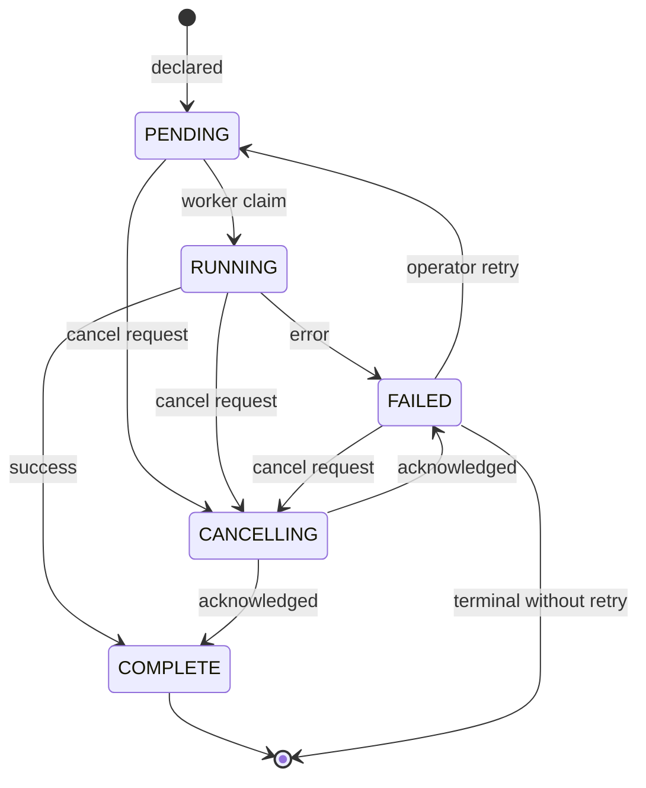

# Task Automation Design

**Product:** TheOracleRPC
**Codename:** Unity

**Design document — `docs/future/task_automation_design.md`**
**Status:** captured design thinking for the future core-tier Task
Orchestration subsystem. **Not a v1.0.0 kernel commitment.**
Implementation details may evolve when core-tier specification lands.
DDL is used as an illustrative consumer throughout; the DDL specifics
are not a locked-in design.

---

## 1. Purpose and scope

This document preserves design thinking for Unity's automation
subsystem — the general term covering Async Tasks (workflow),
Scheduled Tasks (batch/serial), and Worker Tasks (dispatch/claim).
The automation subsystem is a core-tier concern, not a kernel one.
The kernel exposes declaration surfaces (such as
`DatabaseMaintenanceModule.declare_ddl_task`) and the worker contract
(`BaseWorker`); core will own the task substrate, persistence,
dispatch, and lifecycle when that tier is specified.

This document captures the substrate thinking we've accumulated so it
isn't lost between the kernel specification and the eventual core
specification. It describes shapes, mechanics, and state machines at
enough detail to be a useful starting point, but deliberately leaves
specific schemas, tables, and implementation paths open. The `Open
items` section tracks decisions not yet made.

DDL task handling appears throughout as an illustrative consumer.
The kernel's `DatabaseMaintenanceModule` declaration surface stays
in the kernel; what it declares *against* is core machinery covered
here.

---

## 2. The three automation shapes

Unity's automation subsystem covers three shapes of deferred work
under one umbrella. All three share the substrate described in the
following sections; they differ in how declarations are initiated
and how step flow is structured within a single task instance.

**Async Tasks (Workflow)** are long-running, multi-step, and
state-carrying. They may span multiple workers and external calls,
hold intermediate state across steps, and have their execution
interleaved with other work. IoGateway's long-running outbound calls
— where an external API returns a job handle and the result arrives
later — land here. Workflows are expressed as step graphs and carry
per-step state.

**Scheduled Tasks (Batch/Serial)** are time-triggered. They run on
a schedule expression (cron-shaped or interval-shaped), either
periodically or as one-shot future events. The schedule itself is
the declaration surface; when the schedule fires, a task instance is
emitted into the substrate. Scheduled tasks may reference either
single-step operations or full workflows.

**Worker Tasks (Dispatch/Claim)** are queue-mediated, single-step,
claimed atomically by a polling worker and dispatched immediately.
DDL emission is the canonical example: a task is declared, a worker
claims it on its poll cadence, the operation is performed, the
outcome is recorded. Worker tasks are the simplest shape and are
where the claim-and-dispatch mechanics from §7 apply most directly.

All three shapes share the task-definition registry (§8), the
claim/dispatch mechanics (§7), the rollback framing (§6), and the
state machine (§4). The distinction between them lives at the
declaration layer and in the structure of their step graphs, not in
the underlying substrate.

---

## 3. Shared substrate: durable state over direct dispatch

Every automation shape routes through persisted declarations rather
than in-process calls. A caller does not invoke automation work
directly; it declares intent, and the declaration is durable before
any execution happens. This applies even for work that *could* run
synchronously — the substrate's uniformity across the three shapes
depends on declaration being the entry point regardless of whether
the work is fast or slow, immediate or deferred.

Five properties follow from the durable-declaration discipline:

- **No in-process races.** The declarer and the executor never hold
  shared in-process state. Concurrent declarations serialize through
  the persistence layer's insert order.
- **Controlled cadence.** Executors run on their own schedule.
  Nothing in declarer code can force an immediate execution.
- **Restart safety.** Pending work survives reboots. Tasks in flight
  either complete or are re-picked up by the next boot via
  stale-claim recovery.
- **Auditability.** Every decision is a row, with status and
  timestamps, before it runs.
- **Multi-node coordination.** The persistence layer is the arbiter.
  Nodes do not negotiate ownership in-memory; row status and
  database concurrency controls do the work.

This is the same rationale that motivates the privileged-boundary
pattern in `kernel_architecture.md` §6. The automation substrate
generalizes that pattern across the three shapes, each of which
places different demands on the durable layer but shares its core
safety properties.

---

## 4. Task status lifecycle

Every task instance moves through a five-state machine. The states
are `PENDING`, `RUNNING`, `COMPLETE`, `FAILED`, and `CANCELLING`.

The executor performs three transitions automatically: `PENDING →
RUNNING` on claim, `RUNNING → COMPLETE` on success, and `RUNNING →
FAILED` on error. Stale-claim recovery (§7) performs `RUNNING →
PENDING` for tasks abandoned by a crashed node.

Cancellation is operator-driven. `CANCELLING` is a transitional
state — the executor (or a future external actor) acknowledges the
cancellation by transitioning to `FAILED` or `COMPLETE` depending on
whether the cancellation succeeded before work completed. Retry
from `FAILED → PENDING` is also operator-driven in the base case;
automatic retry behavior is discussed in §7.

---

## 5. Disposition: reversal semantics as classification

Every task instance carries a `disposition` classifying its
reversal semantics. Four values:

- **`REVERSIBLE`** — the task's effect can be undone via a
  compensating task. The compensating task is declared separately
  (see §6); disposition marks eligibility, not mechanism.
- **`IRREVERSIBLE`** — the task's effect cannot be undone through
  the system. External recovery is the only remediation path if
  reversal is needed.
- **`TRANSIENT`** — the task has no persistent effect; safe to
  discard mid-execution.
- **`CANCELLABLE`** — the task may be cancelled before or during
  execution without a compensating task.

Disposition is orthogonal to retry eligibility. A task can be
`IRREVERSIBLE` but retry-eligible (an idempotent attempt whose prior
partial effect is safe to re-apply). A task can be `REVERSIBLE` but
not retry-eligible (each attempt has distinct side effects worth
compensating individually). Disposition describes *undo semantics*;
the `can_retry` flag (§7) describes *re-attempt semantics*. Keeping
them separate lets the executor logic read cleanly and lets the
declarer classify along both axes independently.

Disposition informs operator decisions, retry policy, and rollback
eligibility. It does not itself trigger mechanical behavior — see §6
for why rollback is never implicit.

---

## 6. Rollback as a forward action

This is the load-bearing conceptual piece of the rollback design,
and the framing is drawn from financial practice.

Rollback is not a hidden automatic reversal. It is an *additional
task*, explicitly declared, explicitly tracked, with its own
lifecycle. Like a reversing journal entry in accounting: the
original entry stays in the ledger; the reversal is a new entry
that offsets it. Both are visible; both have their own audit trail.

The concrete consequences:

- The original task stays in its terminal state (`FAILED` or
  `COMPLETE`). The rollback does not change the original task's row.
- A compensating task is declared as its own row, with its own
  status, disposition, payload, and audit trail.
- The compensating task can itself fail. When it does, the system
  is in a state that requires human intervention — a failed rollback
  is not automatically recoverable by further mechanical action. The
  operator sees a failed primary task and a failed compensation, and
  decides what to do next.
- Disposition (§5) governs whether a task is a *candidate* for
  compensation; it does not cause compensation to happen. Declaring
  a task `REVERSIBLE` means "a compensating task can be authored and
  declared against this one," not "the system will issue a
  compensating task on failure."

Retry has the same shape. A retry is either a reset of the existing
task row (status flip back to `PENDING`, incremented attempts
counter) or a new row referencing the original — whichever is
decided in §14. Either way, it is an *explicit forward action*, not
a silent re-run hidden inside the executor. Automatic retry is
possible (§7 discusses when) but the data model remains explicit
about every attempt.

This framing avoids the common automation trap of implicit rollback
logic that's hard to reason about, hard to audit, and prone to
cascading failure when the rollback itself fails. Every reversal is
visible as a declared task with its own state machine.

---

## 7. Claim and dispatch mechanics

This section covers the executor-side mechanics shared across the
three automation shapes. Worker Tasks apply it most directly;
Scheduled Tasks apply it after schedule evaluation emits an
instance; Async Tasks apply it per step.

### 7.1 Atomic claim

Claim is a single atomic transition at the persistence layer:
`PENDING → RUNNING`, stamping the started-on timestamp, incrementing
the attempts counter, and returning the claim shape to the executor.
Atomicity is the only coordination point for multi-node safety — no
in-process heartbeats, no node identity tracking.

The claim shape carries enough for the executor to dispatch without
a second persistence read. It includes at minimum the task
identifier, the task-definition reference (§8), the parameter
payload, the resolved control flags (disposition, `can_retry`,
`max_attempts`, `requires_drain`, and others from §7.4), and the
post-claim attempts counter.

### 7.2 Dispatch loop

Executors iterate claim-until-empty before sleeping on their
cadence. Backlog processes at full speed; cadence only applies to
empty queues. On claim, the executor invokes the operation bound in
the task definition, then records the outcome via a
complete-or-fail call back to the persistence layer.

### 7.3 Retry as a tracked data concern

Retry behavior is expressed as data on the task row, not as
executor-internal logic applied to task types. The row carries:

- **`attempts`** — incremented atomically on claim.
- **`can_retry`** — declarer-set flag. When false, the task is
  terminal on first failure regardless of attempts counter.
- **`max_attempts`** — ceiling on retry attempts. When `attempts >=
  max_attempts` after a failure, the task is terminally failed.
- **Backoff policy** — how long to wait before a retry-eligible
  failed task becomes eligible for re-claim. Open item: linear,
  exponential, per-task, or none.

The executor's failure-path logic reads: on error, if `can_retry`
and `attempts < max_attempts`, the task is eligible for another
attempt (mechanics: either status flip back to `PENDING` or a new
row referencing the original — see §14); otherwise the task is
terminally failed and requires operator action.

Stale-claim recovery interacts with this. A `RUNNING` task whose
started-on is older than the configured grace period is transitioned
back to `PENDING` by stale recovery. Whether that counts as an
attempt — that is, whether stale recovery re-increments the attempts
counter or leaves it unchanged — is an open item with real
consequences: counting it lets a badly-stuck task exhaust retries
and stop trying; not counting it means a crash-looping node can
replay the same task indefinitely.

### 7.4 Control flags as a data pattern

The task record is the executor's control surface. Behavioral
variations across tasks — can retry, can cancel, requires drain,
priority, timeout, alert-on-failure routing, operator visibility —
are expressed as columns (or JSON fields) on the task row rather
than as special-case code paths in the executor.

Two consequences. The executor stays uniform: read the flags, apply
the logic. Adding a new behavioral dimension is a schema change
plus a branch in the executor, not a new code path per task type.
The *pattern* of encoding behavior as data on the row is the
captured design decision; which specific flags exist in v1 of the
substrate is an open item.

### 7.5 Stale-claim recovery

Stale-claim recovery runs at executor startup, after the module
manager has sealed. It scans for `RUNNING` tasks whose started-on
is older than the configured grace period (`TaskStaleGraceSeconds`
or similar) and transitions them back to `PENDING` so they become
eligible for re-claim. The grace period functions as the effective
heartbeat timeout in place of in-process node tracking — a node
that crashes mid-dispatch releases its claims after the grace
period elapses.

Recovery returns the count recovered; logged only if non-zero.
Default grace period is an open item.

---

## 8. Task definition registry

The task-definition registry is the catalog of what-can-be-done. It
is separate from the task-instance queue, which is the log of
what-has-been-requested. Defaults live on the registry row;
per-declaration overrides live on the instance row.

### 8.1 What the registry contains

One row per task type. Task types are *registered*, not enumerated
in code — the registry is populated during module install seeding,
and modules contribute task definitions as part of their install
manifest.

Each definition row carries:

- An identifier (name, deterministic GUID)
- A description of the work
- A JSON document describing the steps — the functions called, in
  order, with parameter schemas for each
- Default control flags (`can_retry`, `max_attempts`, default
  disposition, default `requires_drain`, backoff policy, timeout,
  and whatever else §7.4 settles on)
- Binding information — how the definition resolves to executable
  code (provider-method reference, workflow step graph, scheduled
  job handler)

### 8.2 The step JSON document

The step document is the load-bearing piece. Its shape varies by
automation shape:

- **Worker Task** — a single step: one function binding, one
  parameter schema.
- **Async Task (Workflow)** — a sequence or graph of steps, each
  with its own function binding, parameter schema, and potentially
  its own control overrides.
- **Scheduled Task** — the handler binding plus the schedule
  expression. The handler may itself be a single-step operation or
  a reference to a workflow definition.

The specific JSON schema is an open item. Candidate shapes include
flat step lists, DAG-style dependency graphs, and nested
sub-workflows. The decision depends on how expressive the workflow
layer needs to be and intersects with compensation modeling —
rollback steps may want to be defined alongside forward steps in
the same document, letting a workflow carry its own compensation
plan rather than requiring compensation to be authored separately
at declaration time.

### 8.3 GUID references and soft-linked integrity

Step documents reference task definitions by deterministic GUID
rather than via relational foreign key. This is necessary because:

- Workflow steps can reference other workflow steps, forming graphs
  that don't flatten into a clean FK topology.
- Workflow definitions may compose other workflow definitions (a
  parent workflow invoking child workflows as steps).
- The JSON structure varies by task type, so there's no single
  column the database engine can enforce against.

Validation is done at the application layer by the workflow builder:
every GUID reference in a step document is looked up against the
task-definition registry at build time. If the lookup succeeds, the
binding is valid — the remaining step details (parameter schema,
provider-method binding) are already on the definition row, and the
builder can validate parameter shapes against that schema.

This is the one place in Unity's data model where link integrity is
maintained by application logic rather than by database constraints.
It is a deliberate tradeoff: the expressiveness of graph-structured
workflow composition outweighs the loss of FK enforcement for this
specific case. The same trade is visible across the platform
generally — Unity is self-defining and self-referential by design
(the Component Builder can edit the Component Builder), and the
workflow layer fits that pattern rather than violating it.

### 8.4 Workflow audit

Because step bindings are soft-linked, any change to the
task-definition registry — renaming, removing, changing the
parameter schema of an existing task, changing the provider-method
binding — creates the risk of silently invalidating workflows that
reference it. This cannot be caught by database constraints; it
requires a *workflow audit* — a sweep across all registered
workflow definitions validating every step's GUID reference and
parameter contract against the current registry state.

Workflow audit is not a privileged or application-halting
operation. It is a *logged audit event*: an audit sweep runs, a
report is produced, any invalid bindings are surfaced for operator
attention. The application continues to run; workflows with invalid
bindings will fail when they attempt to claim, and those failures
are themselves logged. The audit is a proactive surfacing mechanism,
not a gate.

Natural triggers for workflow audit:

- After any change to the application's task-definition registry
  (module install, module upgrade, manual registry edit).
- Periodically, as a Scheduled Task against the registry itself.
- On demand via operator action.

The audit itself is plausibly implemented as a Worker Task — the
automation system auditing itself is consistent with the platform's
self-referential design, not a violation of it. Open items in §14
cover audit output shape, operator surfacing, and interaction with
other registry-affecting operations.

---

## 9. Declaration and idempotency

Declaration is how work enters the substrate. The declarer names a
task definition (by name or GUID), provides parameters that satisfy
the definition's schema, and optionally provides a control-override
JSON blob that supersedes specific defaults from the definition.

For idempotent declarations, the substrate computes a deterministic
instance GUID from operation and target — for DDL, this would be
`uuid5(NS_HASH, "tasks:ddl:{operation}.{target}")` — so re-declaring
the same logical change hits the same row. Re-declaration of a
task already in `PENDING` or `FAILED` updates spec and flips back
to `PENDING`. Re-declaration of a `RUNNING` or `COMPLETE` task is
an open item — does it supersede the in-flight work, queue a new
attempt, or reject?

Non-idempotent declarations (arbitrary workflow initiations, one-off
async calls, scheduled-task firings) use non-deterministic GUIDs
instead. Deterministic keying is available where it's useful, not
required.

Whether resolved control flags are computed *at declaration* (frozen
into the instance) or *at claim time* (re-read from the current
definition) is an open item. Frozen-at-declaration gives deterministic
behavior even if the registry changes; claim-time re-read lets
operational changes take effect for in-flight tasks. The right
answer probably differs by flag type — disposition probably wants
to freeze, alert routing probably wants to re-read.

---

## 10. Drain coordination for destructive work

Some tasks require the declarer (or a related module) to quiesce
before execution runs. Schema changes are the motivating case — a
`DROP_CONSTRAINT` must not race concurrent DDL declarations through
the same manager. Financial close operations are another: opening a
new journal at the start of a period, or closing a period, may
require the declarer surface to quiesce to guarantee no new entries
land in the closing period.

Captured protocol sketch:

- Task carries a `requires_drain` flag.
- On claim of a drain-required task, the executor signals the
  originating declarer module (or a configured target module) to
  quiesce.
- The declarer acknowledges when no new declarations are in flight.
- The executor proceeds with the task.
- Quiescence is released when the task completes or fails.

Open item: whether drain is declarer-scoped (only the originating
module quiesces) or subsystem-scoped (the whole manager quiesces).
DDL probably wants subsystem-scoped. Financial close probably wants
entity-scoped (a specific journal, not all journals). Other
automation shapes may not need drain at all.

Drain coordination is a form of privileged atomicity — some
operations require pure atomicity and there is no way to shortcut
it. Which operations require it is a per-domain design decision and
is deferred to the modules that declare the work.

---

## 11. Multi-node behavior

When automation runs across nodes, the persistence layer is the
only coordination point.

Claim atomicity is arbitrated by the persistence layer's concurrency
controls. No in-process coordination needed.

Nodes do not track each other's identities or heartbeats. A node
that crashes mid-dispatch releases its claimed tasks to the pool
after the stale-grace period elapses, via stale-claim recovery on
the surviving nodes' next executor startup (or periodic recovery
sweep, if the design includes one).

Scheduled tasks have an additional concern: schedule evaluation
should happen on exactly one node at a time per schedule, even
though task execution can span any node. Captured as an open item —
the persistence layer can coordinate this via a lease-style row
pattern (one node holds a lease on each schedule, releases it on
heartbeat or timeout), but the specifics aren't settled.

Async workflows have a related concern: a multi-step workflow may
have steps pinned to a single node if they carry in-memory state
between steps, or may be free to migrate across nodes if steps are
fully self-contained. The step JSON document (§8.2) may need to
express this affinity. Open item.

---

## 12. DDL as illustrative consumer

This section walks through how the DDL axis looks under the
substrate described above. It is illustrative — the specific design
choices below are not final and will be revisited when core lands.

Each DDL operation (`CREATE_TABLE`, `ALTER_COLUMN`, `CREATE_INDEX`,
`DROP_CONSTRAINT`, `DROP_INDEX`) is a registered task definition.
Each definition binds to a specific method on
`DatabaseManagementProvider`. Each definition carries default
control flags:

- Default disposition: `CREATE_*` defaults `REVERSIBLE` (the
  compensation is the corresponding `DROP_*`); `DROP_*` defaults
  `IRREVERSIBLE` unless the declarer captured the full definition
  for reinstatement; `ALTER_COLUMN` varies (widening reversible,
  narrowing with data loss irreversible).
- Default `can_retry`: DDL operations are largely idempotent when
  guarded by `IF NOT EXISTS` / `IF EXISTS` clauses, so `can_retry`
  probably defaults true. This is operation-specific and arguably
  should be inferred from whether the definition's SQL template
  includes the idempotent guards.
- Default `requires_drain`: false for additive operations; true for
  destructive operations against live schema.

The declarer — `DatabaseMaintenanceModule.declare_ddl_task` —
resolves the operation name to a task-definition GUID, passes the
spec as the parameter payload, optionally overrides controls, and
writes the instance row.

The executor — a `DatabaseManagementWorker`-equivalent in core —
claims pending DDL instances, looks up the definition's provider
binding, invokes the bound method on the composed
`DatabaseManagementProvider`, and records the outcome.

`reconcile_schema()` becomes the primary entry point: it walks
`objects_schema_*` against live schema (via the management
provider's introspection methods) and emits the DDL declarations
necessary to align them.

Note that the substrate does not prescribe DDL-specific structure.
The registry row for `CREATE_TABLE` carries a single-step JSON step
document whose parameter schema describes table specs; the registry
row for a hypothetical `RUN_MIGRATION_SCRIPT` task would carry a
different step document with different parameters. DDL is one
consumer among many.

---

## 13. Self-reference and captured tensions

Unity is self-defining and self-referential by design. The
Component Builder can edit the Component Builder. The task-definition
registry can contain tasks that modify the registry. The automation
system can audit itself. These are not bugs in the design; they are
consequences of a platform whose application is its data.

The tensions this creates are real but manageable:

- **Integrity risks** (§8.4) — soft-linked bindings can be
  invalidated by upstream changes. Workflow audit surfaces these as
  logged events; invalid workflows fail on claim; operators decide
  how to respond.
- **Atomicity requirements** (§10) — some domains require pure
  atomicity (DDL, financial close, period boundaries). Drain
  coordination expresses this. Which operations require atomicity
  is a per-domain decision.
- **Compensating-task failure** (§6) — a failed rollback is not
  automatically recoverable. Human intervention is the only path
  out. The system surfaces this clearly rather than pretending to
  handle it mechanically.

Each of these is a case where the automation system surfaces a
condition for operator attention rather than attempting a hidden
mechanical fix. That is the design principle: self-referential
systems stay tractable when their failure modes are visible and
their recovery paths are explicit.

---

## 14. Open items (consolidated)

*Data model:*

- Task-definition JSON step schema shape (flat step list / DAG /
  nested workflows)
- Whether compensating-task definitions live inside the forward-task
  definition or as separate registered tasks
- Whether resolved control flags are frozen at declaration or
  re-read at claim (probably differs by flag)
- Shared vs. distinct table families across the three automation
  shapes
- Whether the three shapes share a single task-instance table with
  type discriminators, or have one table per shape

*Retry and attempts:*

- Retry mechanics: status flip vs. new row referencing original
- Stale-claim recovery and attempts counter interaction
- `max_attempts` default scoping (definition-level default is
  obvious; whether per-operation or per-category defaults are also
  useful)
- Backoff policy: none / linear / exponential / per-task
- `can_retry` default per operation-type

*Disposition and compensation:*

- Disposition inferred from definition vs. always explicit on
  declaration
- Compensating-task relationship model (FK from compensation to
  original? naming convention? relationship table? in-step-document
  reference?)

*Lifecycle:*

- Re-declaration of `RUNNING`/`COMPLETE` tasks (supersede / queue /
  reject)
- Default stale-grace period (`TaskStaleGraceSeconds` or equivalent)

*Coordination:*

- Drain scoping: declarer-scoped / subsystem-scoped / entity-scoped
- Scheduled-task schedule-evaluation leasing across nodes
- Async-workflow node affinity for stateful steps

*Control flags in v1:*

- Which specific flags (`can_retry`, `can_cancel`, `requires_drain`,
  priority, timeout, alert routing, operator visibility, logging
  level, ...)

*Integrity and audit:*

- Workflow audit implementation path (Worker Task vs. bootstrap
  routine)
- Audit output shape and operator surfacing
- Whether audit runs incrementally on every registry change or
  periodically in a sweep

---

## 15. What this doc doesn't cover

Specific table schemas for the task substrate — columns, indexes,
constraints — are core-tier and defined when core lands. This doc
names fields conceptually (`attempts`, `can_retry`, `pub_spec`,
etc.) without committing to physical column names or types.

Worker class structure beyond the `BaseWorker` contract that lives
in the kernel. Concrete worker implementations and their internal
dispatch mechanics are core-tier.

How the declaration surface reaches the substrate. Kernel declarers
(like `DatabaseMaintenanceModule.declare_ddl_task`) will call into
core's declaration API, but the cross-tier interface for that call
— is it a module manager lookup? a registered callback? a direct
import? — is specified when core's declaration contracts are
drafted.

IoGateway's long-running outbound coordination. The section of
`kernel_architecture.md` §9 that references "Task Orchestration
subsystem" for async result polling points here, but the specific
handoff shape is a core-tier design decision.

Financial close, period boundary, and other domain-specific
privileged-atomicity cases. These are named as motivating examples
for drain coordination (§10) but their specific declaration surfaces
and control flag combinations are per-domain work.

The relationship between the kernel's `BaseWorker` ABC and the
core-tier worker implementations. `BaseWorker` defines `start()` and
`stop()` only; core workers will layer substantial additional
contract on top, potentially as a `BaseTaskWorker` or equivalent
core-level ABC.