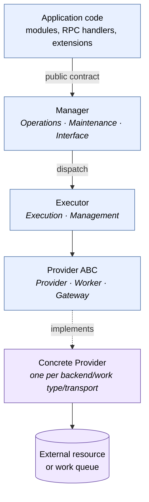

# Kernel Architecture

**Product:** TheOracleRPC
**Codename:** Unity

**Spec document — `docs/kernel_architecture.md`**
**Status:** authoritative reference for the Manager/Executor/Provider pattern and the kernel subsystem inventory.

---

## 1. Purpose and scope

Unity's kernel hosts a small number of **subsystems** that mediate
between the application and classes of external resource or boundary.
Every subsystem follows the same structural pattern: a **Manager**, an
**Executor**, and one or more **Providers**. This document defines
that pattern, names its roles, and shows how each current kernel
subsystem realizes it.

Unity's codebase is layered. The **kernel** is the bottom tier — it
mediates external boundaries and has no knowledge of application
semantics. The **core** tier sits on top of the kernel and builds the
application foundation (users, security context, storage, task
orchestration) that every deployment needs. Application modules,
extensions, and packages layer above core. Dependencies run one
direction: kernel never imports core, core never imports application
modules. Core modules use the same Manager/Executor/Provider pattern
defined here; their specifications live in `core_architecture.md` and
the per-subsystem core specs.

Lifecycle mechanics — how modules start, seal, drain, and shut down —
belong in `module_lifecycle.md`. Provider-layer mechanics —
contracts, primary vs. composed providers, handle borrowing — belong
in `provider_composition.md`. Each kernel subsystem has its own spec
that details the concrete contract, data model, and seeding:
`database_management.md`, `auth.md`, `iogateway.md`.

---

## 2. What a kernel subsystem is

A kernel subsystem is a cluster of kernel modules that together
mediate one category of external interaction. "External" here is
strict: a database backend, an identity provider, an inbound
transport, an outbound API. Anything where Unity talks to something
that is not Unity, and where that conversation has protocol variation
worth abstracting.

Three kernel subsystems exist:

- **Database** — SQL execution against a provider-swappable backend.
- **Auth** — identity verification, authorization resolution, and
  token decoding against external identity providers and internal
  token formats.
- **IoGateway** — inbound and outbound traffic across all transports
  and external services.

Core subsystems — **Users**, **Security**, **Storage**, and **Task
Orchestration** — also follow the Manager/Executor/Provider pattern
defined in this document but are not part of the kernel. They consume
kernel subsystems and extend them (for example, the Users module
registers identity-creation hooks with Auth). See
`core_architecture.md`.

Application code — application modules, extensions, packages — talks
to a kernel or core subsystem only through its manager. Application
code never imports an executor, never references a provider class,
and never touches the external resource directly. The manager is the
entire agreement between the subsystem and the rest of the
application.

The strictness of these patterns — queue-mediated privileged
boundaries, IoGateway's single entry point, database-backed state
for anything that has to survive a restart — is what makes multi-node
deployment possible. Quorum, node-startup coordination, and
horizontal scaling mechanics are out of scope for this document, but
the patterns defined here are the foundation those mechanics will
rest on. Any shortcut around a manager, any direct resource access
from application code, and any in-process bypass of a privileged
boundary undermines that foundation.

---

## 3. The three roles

Every subsystem is composed of three roles — **Manager**, **Executor**,
and **Provider** — each with one reason to change. Each role is an
abstract slot in the pattern, and each slot has a small set of
concrete *role-names* that describe what that specific module does
within its subsystem. The abstract role answers "what class of
responsibility does this module have in the pattern?"; the role-name
answers "what kind of work, specifically?"

### 3.1 The taxonomy

The vocabulary is finite and the slots do not share names with each
other.

| Slot | Role-name | What it describes |
|---|---|---|
| **Manager** | **Operations** | Hot-path public contract — callers request, manager serves. Used for frequent request/response work (Database reads/writes, Auth). |
| **Manager** | **Maintenance** | Privileged public contract — callers declare intent, which is persisted for later dispatch. Used for destructive or serialized work that must not be invocable in-process (Database DDL). |
| **Manager** | **Interface** | Symmetrical public contract — traffic flows through the manager in both directions. Used when the subsystem mediates both inbound and outbound traffic (IoGateway). |
| **Executor** | **Execution** | In-process executor that dispatches directly through its provider contract. Paired with Operations and Interface managers. |
| **Executor** | **Management** | Queue-mediated executor that polls a declaration queue and dispatches through its provider contract on its own cadence. Paired with Maintenance managers. |
| **Provider** | **Provider** | Mediates an external resource through a protocol-agnostic contract. Used when the work is a direct call to something outside Unity (SQL backends, identity providers, transports). |
| **Provider** | **Worker** | Performs dispatched work handed to it by its executor. Used when the work is asynchronous relative to the declaration — performed later, possibly by something separable from the dispatcher itself (DDL application). |
| **Provider** | **Gateway** | Normalizes traffic into or out of the subsystem. Used by the symmetrical boundary where the provider role is neither resource mediation nor dispatched work but bidirectional shape translation (IoGateway's RPC, MCP, API, Discord providers). |

The Manager role and the Executor role each pair naturally with
specific role-names on the other slot. Operations managers pair with
Execution executors. Maintenance managers pair with Management
executors. Interface managers pair with Execution executors. The
Provider slot's role-name is chosen per-subsystem based on what the
provider actually does.

### 3.2 Why the taxonomy has two axes

The naming can be confusing because Maintenance and Management look
similar and Operations and Execution look similar. They are naming
different things.

**Slot** (Manager / Executor / Provider) describes **which class of
responsibility** the module has in the pattern: is it the public
contract, the resource-owning dispatcher, or the protocol-specific
implementation?

**Role-name** (Operations, Maintenance, Interface, Execution,
Management, Provider, Worker, Gateway) describes **what kind of
work** the module does: is it hot-path serving, privileged
declaration, symmetric bidirectional flow, direct dispatch,
queue-mediated dispatch, resource mediation, dispatched work, or
shape normalization?

Both axes are load-bearing. Dropping the slot axis would conflate
modules with different responsibilities (`DatabaseOperationsModule`
the manager vs. `DatabaseExecutionModule` the executor — both sit on
the hot path but have different jobs). Dropping the role-name axis
would conflate subsystems with different contract boundaries (a hot-
path Operations manager and a privileged Maintenance manager have
the same slot but shouldn't have the same name).

### 3.3 Manager

The Manager is the subsystem's public contract. It accepts work from
application code, enforces policy, and delegates execution. It does
not own the external resource, does not speak any protocol, and does
not know which concrete provider is installed. Its entire job is to
expose a stable, well-named API to the rest of the application.

Manager role-names reflect the nature of the contract boundary —
hot-path, privileged, or symmetric. See the taxonomy table in §3.1.
New role-names may be added if a future subsystem exposes a contract
boundary none of these cover, but Operations, Maintenance, and
Interface are expected to cover most cases.

### 3.4 Executor

The Executor owns the resource handle — the connection pool, the
HTTP client set, the transport lifecycles, the task queue. It
selects a concrete provider at startup based on configuration, opens
the resource, and exposes a provider-agnostic surface to its
manager. Executors are the single point of coupling between the
subsystem's provider contract and a concrete implementation; adding
a new backend means writing a provider subclass and adding a branch
to the executor's startup selection.

Executor names follow the form `<Subsystem><ExecutorRoleName>Module`:
`DatabaseExecutionModule`, `AuthExecutionModule`,
`IoGatewayExecutionModule`, `DatabaseManagementModule`. When a
subsystem exposes a second contract boundary, it adds a second
executor that composes over the first — the Database subsystem
demonstrates this with `DatabaseManagementModule`, which handles the
Maintenance/Management axis by composing a second provider layer
over the connection pool owned by `DatabaseExecutionModule`.
Composition is the extension mechanism for the executor contract;
each executor owns its own provider dispatch while sharing the
underlying resource. Mechanics in `provider_composition.md`.

### 3.5 Provider

A Provider is an ABC that isolates protocol-specific, work-specific,
or shape-specific implementation. Each concrete provider corresponds
to one external backend, identity source, transport, external
service, recognized token format, or unit of dispatchable work.
Providers never leak into application code — they are an
implementation detail of the executor that hosts them.

The Provider slot has three role-names because providers answer
three different kinds of question:

- **Provider** — "how does Unity talk to this external resource?"
- **Worker** — "how is this unit of dispatched work performed?"
- **Gateway** — "how does this transport's native shape map to
  Unity's normalized envelope, in both directions?"

A subsystem may use one or more provider role-names. Database uses
Provider on the Execution axis (`MssqlProvider`) and Worker on the
Management axis (workers that apply DDL from the task queue). Auth
uses Provider. IoGateway uses Gateway. Future subsystems may
introduce new provider role-names if they answer a genuinely new
kind of question; the existing three are expected to cover most
cases.

Provider naming is **folder-scoped**. Each subsystem has its own
provider folder (`database_execution_providers/`,
`auth_execution_providers/`, `iogateway_interface_providers/`), and
provider class names disambiguate within that folder rather than
across the whole codebase. Short names are preferred:
`MssqlProvider`, `GoogleProvider`, `RpcProvider`. Cross-subsystem
collisions are resolved by import path — a `DiscordProvider` in
`auth_execution_providers/` and a `DiscordProvider` in
`iogateway_interface_providers/` coexist cleanly because they
represent genuinely different services (identity verification vs.
transport) under the same vendor.

When a single vendor exposes multiple resources with different
endpoints, claim shapes, or lifecycle characteristics, each is its
own provider (`MicrosoftProvider` for consumer MSA,
`EntraProvider` for tenant identities). The principle is that
providers are split by the *resource* they address, not by the
vendor that hosts it.

---

## 4. Pattern diagram

Everything above the provider contract line is protocol-agnostic.
Everything at or below the concrete provider is protocol-specific.
The executor is the chokepoint — it is the only kernel component
that imports a concrete provider class.

---

## 5. Contract-boundary taxonomy

Unity's subsystems vary along the nature of their contract boundary.
Some have one boundary; some have two. The taxonomy maps each
boundary type to a manager role-name and its paired executor
role-name.

| Boundary | Manager role-name | Executor role-name | Dispatch mode | Characteristics |
|---|---|---|---|---|
| **Symmetrical** | Interface | Execution | in-process, bidirectional | Traffic flows through the manager in both directions. Normalization on inbound, denormalization on outbound. |
| **Hot-path** | Operations | Execution | in-process, synchronous-feeling | Frequent request/response. One await per hop, no queuing. |
| **Privileged** | Maintenance | Management | queue-mediated | Callers declare intent by persisting a row. A monitor loop picks it up on its own cadence. Never invocable directly in-process. |

A subsystem has one manager per boundary it exposes. Database has two
managers because it exposes both a hot-path boundary (operations) and
a privileged boundary (maintenance). Auth and IoGateway each have one
boundary.

The privileged boundary is the one where the pattern diverges
meaningfully from the others. Its properties and the reasons for them
are covered next.

---

## 6. The privileged boundary

Some subsystem operations must not be invocable directly from
application code. DDL emission is the canonical example: it is rare,
destructive, must be serialized against itself, and must be auditable
after the fact. In-process method dispatch satisfies none of these
requirements.

The privileged boundary sits between two kernel modules in the same
subsystem: a **Maintenance manager** and a **Management executor**.
The handoff is a row in a database table. The Maintenance manager
writes the row; the Management executor polls the table on its
configured cadence and dispatches the work through its composed
provider, which on this axis is a Worker rather than a resource-
mediating Provider.

The consequences of this shape:

- **No races.** The Maintenance manager and the Management executor
  never hold shared in-process state. Concurrent `declare_ddl_task`
  calls serialize through the table's insert order.
- **Controlled cadence.** The Management executor runs only as often
  as its poll interval allows. Nothing in application code can force
  an immediate DDL application.
- **Restart safety.** Pending tasks persist across restarts. Running
  tasks either complete or are re-picked up by the next boot.
- **Auditability.** Every privileged decision is a row, with status
  and timestamps, before it runs.
- **Multi-node safety.** When Unity runs on more than one node, the
  table is the coordination point. Nodes do not need to negotiate
  ownership of a task in-memory; the row's status column and the
  database's own concurrency controls arbitrate.

Queue semantics, task lifecycle, monitor-loop cadence, Worker
dispatch mechanics, and drainstop coordination are specific to the
Database subsystem's implementation and are detailed in
`database_management.md`. The pattern itself — queue-mediated
handoff to a Worker as the safety model for privileged work —
generalizes, and is the same shape the core-tier Task Orchestration
subsystem uses for application-facing workflow state.

Security considerations for the privileged boundary are covered in
`security.md`.

---

## 7. Database subsystem

The Database subsystem has both a hot-path boundary and a privileged
boundary. Six modules total, two providers, one shared connection
pool.

| Axis | Manager | Executor | Provider contract | Concrete |
|---|---|---|---|---|
| Operations (hot path) | `DatabaseOperationsModule` | `DatabaseExecutionModule` | `DatabaseTransactionProvider` (Provider role-name) | `MssqlProvider` |
| Maintenance (privileged) | `DatabaseMaintenanceModule` | `DatabaseManagementModule` | `DatabaseManagementProvider` (Worker role-name) | `MssqlManagementProvider` |

Hot-path dispatch is in-process: caller → `DatabaseOperationsModule`
→ `DatabaseExecutionModule` → `DatabaseTransactionProvider` →
`MssqlProvider` → pool. Every hop is one `await`. No queuing.

Privileged dispatch is queue-mediated:
`DatabaseMaintenanceModule.declare_ddl_task(...)` writes a row to
`service_tasks_ddl`; `DatabaseManagementModule` runs a monitor loop
gated by the `TaskDdlPollRate` configuration key that picks up
pending rows and dispatches through the composed Worker.

The two providers share the connection pool. `DatabaseExecutionModule`
owns the pool; `DatabaseManagementModule` borrows the live
`DatabaseTransactionProvider` during its own startup via
`exec_mod.get_base_provider()` and composes a
`DatabaseManagementProvider` over it. The mechanics of that
composition — how the handle is exposed, when it is valid to request,
and why composition is preferred over inheritance — are in
`provider_composition.md`, which also carries the two-axis diagram
showing the shared pool and the task table boundary. Queue semantics,
Worker dispatch, and task lifecycle are in `database_management.md`.

---

## 8. Auth subsystem

The Auth subsystem has a single hot-path boundary.

| Manager | Executor | Provider contract | Concrete providers |
|---|---|---|---|
| `AuthOperationsModule` | `AuthExecutionModule` | `AuthProvider` (Provider role-name) | identity providers + token providers (see below) |

`AuthOperationsModule` exposes the public contract for authentication
and authorization resolution. `AuthExecutionModule` owns the
registered provider set and any shared HTTP client state.

### 8.1 The three-method contract

The `AuthProvider` ABC defines three primary methods:

- **`resolve_identity`** — Runs the external identity flow. The user
  is redirected to an identity provider; the provider returns an
  assertion carrying a subject identifier; this method resolves that
  subject to an internal identity GUID. Token normalization — lifting
  the provider-native token into a common shape — happens here as
  part of identity resolution. Microsoft's hybrid AD token is the
  superset model; the normalized shape is derived from it.

- **`resolve_authorization`** — Given an internal identity, resolves
  the roles, entitlements, and scopes that identity carries at this
  moment. The output is the security context consumed by RPC's
  authorization layer. Called on every request after initial
  authentication, not just at login.

- **`resolve_token`** — Decodes a pre-existing token back to an
  internal identity without going through a fresh external handshake.
  Handles bearer tokens (React client sessions), MCP dynamic-client-
  registration tokens, and static long-lived API tokens. The provider
  figures out which token format it's looking at and resolves.

All three methods default to returning **unauthorized**. A provider
that doesn't implement a given method returns unauthorized from it.
The subsystem as a whole returns unauthorized when no provider
matches, when no hook is registered for identity creation, or when
any step in the resolution chain declines. Unauthorized is the safe
default and the shipping default.

### 8.2 Provider sub-families

Concrete providers fall into two functional shapes under the single
`AuthProvider` ABC:

**Identity providers** run external OAuth/OIDC flows against
third-party identity sources. They implement `resolve_identity`
meaningfully; `resolve_token` typically returns unauthorized
(identity providers don't decode Unity-issued tokens).

- `GoogleProvider`
- `MicrosoftProvider` (consumer MSA)
- `EntraProvider` (Microsoft tenant identities)
- `DiscordProvider`
- `AppleProvider` (future)
- `MetaProvider` (future)

**Token providers** decode Unity-recognized token formats back to
internal identities. They implement `resolve_token` meaningfully;
`resolve_identity` typically returns unauthorized (token providers
don't run external flows).

- `BearerProvider` — React client sessions and other issued bearer
  tokens.
- `McpDcrProvider` — MCP dynamic client registration tokens.
- `StaticApiProvider` — administratively issued long-lived API
  tokens.

Both sub-families implement `resolve_authorization` against the same
internal authorization store.

### 8.3 Per-provider configuration

Each provider has a custom table holding its protocol-specific
configuration: authorization and token endpoints, redirect URI,
scope set, client credentials reference, and provider-specific
fields. The table schema varies per provider because the
configuration surface varies per provider — collapsing them into a
single generic table would force a lowest-common-denominator shape
that discards load-bearing detail.

Identity records are keyed by the provider's subject identifier as
the natural key, not by a Unity-generated UUID. UUIDs are for
internal entities; external identity correlation uses the identifier
the provider itself issued.

### 8.4 Hook surface for identity creation

The Auth subsystem is designed to run without a user module. In a
kernel-only deployment, `resolve_identity` correctly returns
unauthorized for every external subject — there is no internal
identity store to resolve against, no user records to match, and
nothing downstream that would consume an authenticated identity.

`resolve_identity` exposes a **hook surface** that a core-tier user
module registers against. When a provider resolves a valid external
assertion whose subject has no existing internal identity, the hook
is invoked; if a hook is registered, it may create the identity and
return its GUID. If no hook is registered, the default behavior
holds: unauthorized. This is the mechanism by which the core-tier
Users module participates in Auth without Auth importing Users.

Hook signatures, registration mechanics, and the corresponding
hook on `resolve_token` for stale-token cases are specified in
`auth.md`.

Full contract, table layouts, and flow details are in `auth.md`.

---

## 9. IoGateway subsystem

The IoGateway subsystem has a single symmetrical boundary. This is
the only subsystem in the kernel where traffic flows through the
manager in both directions — inbound requests normalize into a
common envelope, and outbound calls denormalize into each external
service's native shape. The manager is named `IoGatewayInterfaceModule`
to reflect that symmetry.

| Manager | Executor | Provider contract | Concrete providers |
|---|---|---|---|
| `IoGatewayInterfaceModule` | `IoGatewayExecutionModule` | `IoGatewayProvider` (Gateway role-name) | `RpcProvider`, `McpProvider`, `ApiProvider`, `DiscordProvider`, plus outbound service providers |

`IoGatewayInterfaceModule` is the first-class single entry point for
all traffic crossing the Unity boundary. `IoGatewayExecutionModule`
owns the per-provider lifecycles. Concrete providers come in two
shapes:

**Inbound transport providers** accept traffic initiated outside
Unity, normalize it into a common envelope, and hand off to RPC. RPC
remains the security contract enforcement layer — IoGateway
normalizes; RPC authorizes and dispatches.

- `RpcProvider` — HTTP traffic, including the React client.
- `McpProvider` — Model Context Protocol.
- `ApiProvider` — programmable API clients.
- `DiscordProvider` — Discord bot traffic.

**Outbound service providers** initiate calls from Unity to external
APIs and return their responses through the same normalization
surface. These are shaped differently from inbound transports —
there is no accept loop, the call is request/response with the
direction inverted, and the concerns that dominate are credential
handling, rate limits, retry semantics, and (for long-running
operations) asynchronous result polling. They sit in the same
subsystem because they share the envelope contract and the
single-entry-point discipline: nothing in application code calls an
external API directly, everything goes through the gateway.

Long-running outbound calls — where the initial call returns a job
handle and the result arrives later — are coordinated by the
core-tier Task Orchestration subsystem, which owns workflow state,
polling cadence, and fan-out to downstream destinations. See
`core_architecture.md`.

This is a significant shift from the legacy system, where
transport-specific assumptions leaked into RPC handlers and
authorization logic leaked into transport code. In Unity, every
transport and every external service is a peer under one contract,
and the RPC layer sees a single normalized shape regardless of
origin or direction.

Full envelope shape, transport-specific mappings, outbound-provider
semantics, and the RPC handoff contract are in `iogateway.md`.

---

## 10. When to add a new kernel subsystem

The kernel is expected to stay small. New kernel subsystems are rare
— most new functionality belongs in core or application modules that
consume the existing three kernel subsystems.

A new kernel subsystem is warranted when all three of these hold:

1. It mediates a category of external boundary that none of
   Database, Auth, or IoGateway covers. Blob storage, for example,
   is *not* such a category — it is handled in core because its
   integration with application data is tight enough to pull it above
   the kernel tier.
2. The boundary has protocol variation that benefits from an ABC —
   multiple backends or services under one contract.
3. The subsystem must sit below core in the dependency order. If a
   candidate could equally well live in core and consume existing
   kernel subsystems, it belongs in core.

A new kernel subsystem is **not** warranted when:

- The work is application logic that can live in a core or
  application module consuming existing kernel managers.
- The variation is in data or behavior, not protocol — a rules
  engine, a workflow engine, or a content pipeline is not a kernel
  subsystem.
- The resource is already mediated by an existing kernel subsystem
  at a different level of abstraction (e.g., a new SQL backend is a
  new provider in the Database subsystem, not a new subsystem).

---

## 11. What this pattern doesn't cover

Not every kernel module is part of a subsystem. The Manager/Executor/
Provider pattern applies where protocol variation and resource
ownership warrant it; elsewhere, simpler shapes are correct.

- **Pure cache modules** — `SystemConfigurationModule`,
  `ServiceEnumModule`. These load a table at startup and expose a
  synchronous lookup API. No external resource, no provider layer,
  no executor. They are kernel modules that happen to use the
  Database subsystem's Operations manager during their own startup.
- **Pure lookup/dispatch modules** — these route calls based on
  registered data but do not own an external resource. They may
  consume subsystem managers but do not themselves follow the M/E/P
  pattern.
- **The environment module** — `EnvironmentVariablesModule`. Reads a
  file once at startup. No subsystem shape is appropriate or needed.

These modules participate fully in the module lifecycle (startup,
seal, drain, shutdown) without participating in the subsystem
pattern. The pattern is applied where it earns its cost, not
universally.
