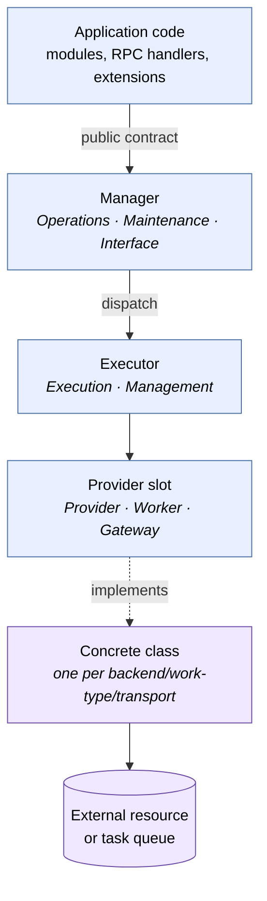

# Kernel Architecture

**Product:** TheOracleRPC
**Codename:** Unity

**Spec document — `docs/kernel_architecture.md`**
**Status:** authoritative reference for the Manager/Executor/Provider pattern and the kernel subsystem inventory.

---

## 1. Purpose and scope

Unity's kernel hosts a small number of **subsystems** that mediate
between the application and classes of external resource or boundary.
Every subsystem follows the same structural pattern: a **Manager**, an
**Executor**, and one or more **Providers**. This document defines
that pattern, names its roles, and inventories the kernel subsystems
that realize it.

Unity's codebase is layered. The **kernel** is the bottom tier — it
mediates external boundaries and has no knowledge of application
semantics. The **core** tier sits on top of the kernel and builds the
application foundation (users, security context, storage, task
orchestration) that every deployment needs. Application modules,
extensions, and packages layer above core. Dependencies run one
direction: kernel never imports core, core never imports application
modules. Core modules use the same Manager/Executor/Provider pattern
defined here; their specifications live in `core_architecture.md` and
the per-subsystem core specs.

Lifecycle mechanics — how modules start, seal, drain, and shut down —
are in `module_lifecycle.md`. Provider-layer mechanics — primary vs.
composed providers, handle borrowing — are in `provider_composition.md`.
Each kernel subsystem has its own spec that details the concrete
contract, data model, and seeding: `database_management.md`,
`auth.md`, `iogateway.md`.

---

## 2. What a kernel subsystem is

A kernel subsystem is a cluster of kernel modules that together
mediate one category of external interaction. "External" here is
strict: a database backend, an identity provider, an inbound
transport, an outbound API. Anything where Unity talks to something
that is not Unity, and where that conversation has protocol variation
worth abstracting.

Three kernel subsystems exist:

- **Database** — SQL execution against a provider-swappable backend.
- **Auth** — identity verification, authorization resolution, and
  token decoding against external identity providers and internal
  token formats.
- **IoGateway** — inbound and outbound traffic across all transports
  and external services.

Core subsystems — **Users**, **Security**, **Storage**, and **Task
Orchestration** — also follow the Manager/Executor/Provider pattern
defined here but are not part of the kernel. They consume kernel
subsystems and extend them (for example, the Users module registers
identity-creation hooks with Auth). See `core_architecture.md`.

Application code — application modules, extensions, packages — talks
to a kernel or core subsystem only through its manager. Application
code never imports an executor, never references a provider class,
and never touches the external resource directly. The manager is the
entire agreement between the subsystem and the rest of the
application.

The strictness of these patterns — queue-mediated privileged
boundaries, IoGateway's single entry point, database-backed state
for anything that has to survive a restart — is what makes multi-node
deployment possible. Quorum, node-startup coordination, and
horizontal scaling mechanics are out of scope for this document, but
the patterns defined here are the foundation those mechanics will
rest on. Any shortcut around a manager, any direct resource access
from application code, and any in-process bypass of a privileged
boundary undermines that foundation.

---

## 3. The three roles

Every subsystem is composed of three roles — **Manager**, **Executor**,
and **Provider** — each with one reason to change. Each role is an
abstract **slot** in the pattern, and each slot has a small set of
concrete **role-names** that describe what that specific module does
within its subsystem. The abstract slot answers "what class of
responsibility does this module have?"; the role-name answers "what
kind of work, specifically?"

### 3.1 The taxonomy

The vocabulary is finite and the slots do not share names with each
other.

| Slot | Role-name | What it describes |
|---|---|---|
| **Manager** | **Operations** | Hot-path public contract — callers request, manager serves. Used for frequent request/response work (Database reads/writes, Auth). |
| **Manager** | **Maintenance** | Privileged public contract — callers declare intent, which is persisted for later dispatch. Used for destructive or serialized work that must not be invocable in-process (Database DDL). |
| **Manager** | **Interface** | Symmetrical public contract — traffic flows through the manager in both directions. Used when the subsystem mediates both inbound and outbound traffic (IoGateway). |
| **Executor** | **Execution** | In-process executor that dispatches directly through its provider contract. Paired with Operations and Interface managers. |
| **Executor** | **Management** | Queue-mediated executor that polls a declaration queue and dispatches on its own cadence. Paired with Maintenance managers. |
| **Provider** | **Provider** | Mediates an external resource through a protocol-agnostic contract. Used when the work is a direct call to something outside Unity (SQL backends, identity providers, transports). |
| **Provider** | **Worker** | Performs dispatched work handed to it by its executor. Used when the work is asynchronous relative to the declaration — a loop that claims and executes queued tasks (DDL application). |
| **Provider** | **Gateway** | Normalizes traffic into or out of the subsystem. Used by the symmetrical boundary where the provider role is bidirectional shape translation (IoGateway's RPC, MCP, API, Discord providers). |

The Manager role and the Executor role each pair naturally with
specific role-names on the other slot. Operations managers pair with
Execution executors. Maintenance managers pair with Management
executors. Interface managers pair with Execution executors. The
Provider slot's role-name is chosen per-subsystem based on what the
provider actually does.

### 3.2 Why the taxonomy has two axes

The naming can be confusing because Maintenance and Management look
similar and Operations and Execution look similar. They are naming
different things.

**Slot** (Manager / Executor / Provider) describes **which class of
responsibility** the module has in the pattern: is it the public
contract, the resource-owning dispatcher, or the protocol-specific
implementation?

**Role-name** (Operations, Maintenance, Interface, Execution,
Management, Provider, Worker, Gateway) describes **what kind of
work** the module does: is it hot-path serving, privileged
declaration, symmetric bidirectional flow, direct dispatch,
queue-mediated dispatch, resource mediation, dispatched work, or
shape normalization?

Both axes are load-bearing. Dropping the slot axis would conflate
modules with different responsibilities (`DatabaseOperationsModule`
the manager vs. `DatabaseExecutionModule` the executor — both sit on
the hot path but have different jobs). Dropping the role-name axis
would conflate subsystems with different contract boundaries (a hot-
path Operations manager and a privileged Maintenance manager have
the same slot but shouldn't have the same name).

### 3.3 Manager

The Manager is the subsystem's public contract. It accepts work from
application code, enforces policy, and delegates execution. It does
not own the external resource, does not speak any protocol, and does
not know which concrete provider is installed. Its entire job is to
expose a stable, well-named API to the rest of the application.

Manager role-names reflect the nature of the contract boundary —
hot-path, privileged, or symmetric. See the taxonomy table in §3.1.
New role-names may be added if a future subsystem exposes a contract
boundary none of these cover, but Operations, Maintenance, and
Interface are expected to cover most cases.

### 3.4 Executor

The Executor owns the resource handle — the connection pool, the
HTTP client set, the transport lifecycles. It selects a concrete
provider at startup based on configuration, opens the resource, and
exposes a provider-agnostic surface to its manager. Executors are
the single point of coupling between the subsystem's provider
contract and a concrete implementation; adding a new backend means
writing a provider subclass and adding a branch to the executor's
startup selection.

Executor names follow the form `<Subsystem><ExecutorRoleName>Module`:
`DatabaseExecutionModule`, `AuthExecutionModule`,
`IoGatewayExecutionModule`, `DatabaseManagementModule`. When a
subsystem exposes a second contract boundary, it adds a second
executor that composes over the first — the Database subsystem
demonstrates this with `DatabaseManagementModule`, which handles the
Maintenance/Management axis by composing a second provider layer
over the connection pool owned by `DatabaseExecutionModule`.
Composition is the extension mechanism for the executor contract;
each executor owns its own provider dispatch while sharing the
underlying resource. Mechanics in `provider_composition.md`.

### 3.5 Provider

A Provider-slot module is an ABC or concrete class that isolates
protocol-specific, work-specific, or shape-specific implementation.
Provider-slot modules live in the subsystem's provider folder
(`database_execution_providers/`, `auth_execution_providers/`,
`iogateway_interface_providers/`) — everything in that folder is in
the Provider slot, regardless of which role-name it takes.

The Provider slot has three role-names because providers answer
three different kinds of question:

- **Provider** — "how does Unity talk to this external resource?"
  A protocol-specific implementation of a resource-mediating
  contract. `MssqlProvider` implements `DatabaseTransactionProvider`
  against a live SQL Server connection pool.
- **Worker** — "how is dispatched work actually performed?" A loop
  class that claims queued tasks and executes them. Paired with a
  Management executor; consumes the executor's composed resource
  provider to do its work. `DatabaseManagementWorker` is the DDL
  worker.
- **Gateway** — "how does this transport's native shape map to
  Unity's normalized envelope, in both directions?" Used by the
  symmetrical boundary. IoGateway's `RpcProvider`, `McpProvider`,
  etc. occupy this role-name.

A subsystem may use one or more provider role-names. The Database
subsystem uses Provider (`MssqlProvider`, `MssqlManagementProvider`)
and Worker (`DatabaseManagementWorker`). Auth uses Provider.
IoGateway uses Gateway. Future subsystems may introduce a new
provider role-name if they answer a genuinely new kind of question.

The cross-subsystem `BaseWorker` ABC lives in the kernel's top-level
`__init__.py` alongside `BaseModule` because every subsystem with a
Maintenance/Management axis uses it. Concrete worker classes that
implement `BaseWorker` live in their subsystem's provider folder —
`DatabaseManagementWorker` lives in `database_execution_providers/`,
for example. `BaseWorker`'s placement is an artifact of Python
import mechanics (kernel primitives co-located for every subsystem
to reach), not a reclassification of workers outside the Provider
slot. Workers *are* Provider-slot modules; they share a folder with
their subsystem's other providers. `BaseWorker`'s lifecycle contract
(`start()`, `stop()`) is covered in `module_lifecycle.md §11`; the
work contract a worker implements — claim, dispatch, mark
complete/failed — is supplied by the core-tier Task Orchestration
substrate (§6).

Provider naming is **folder-scoped**. Provider class names
disambiguate within their folder rather than across the whole
codebase. Short names are preferred: `MssqlProvider`,
`GoogleProvider`, `RpcProvider`. Cross-subsystem collisions are
resolved by import path — a `DiscordProvider` in
`auth_execution_providers/` and a `DiscordProvider` in
`iogateway_interface_providers/` coexist cleanly because they
represent genuinely different services (identity verification vs.
transport) under the same vendor.

When a single vendor exposes multiple resources with different
endpoints, claim shapes, or lifecycle characteristics, each is its
own provider (`MicrosoftProvider` for consumer MSA, `EntraProvider`
for tenant identities). The principle is that providers are split
by the *resource* they address, not by the vendor that hosts it.

---

## 4. Pattern diagram

Everything above the Provider-slot line is protocol-agnostic.
Everything at or below the concrete class is protocol-specific or
work-specific. The executor is the chokepoint — it is the only
kernel component that imports a concrete provider-slot class.

---

## 5. Contract-boundary taxonomy

Unity's subsystems vary along the nature of their contract boundary.
Some have one boundary; some have two. The taxonomy maps each
boundary type to a manager role-name and its paired executor
role-name.

| Boundary | Manager role-name | Executor role-name | Dispatch mode | Characteristics |
|---|---|---|---|---|
| **Symmetrical** | Interface | Execution | in-process, bidirectional | Traffic flows through the manager in both directions. Normalization on inbound, denormalization on outbound. |
| **Hot-path** | Operations | Execution | in-process, synchronous-feeling | Frequent request/response. One await per hop, no queuing. |
| **Privileged** | Maintenance | Management | queue-mediated | Callers declare intent by persisting a row. A monitor loop picks it up on its own cadence. Never invocable directly in-process. |

A subsystem has one manager per boundary it exposes. Database has
two managers because it exposes both a hot-path boundary (operations)
and a privileged boundary (maintenance). Auth and IoGateway each
have one boundary.

The privileged boundary is the one where the pattern diverges
meaningfully from the others. Its properties and the reasons for
them are covered next.

---

## 6. The privileged boundary

Some subsystem operations must not be invocable directly from
application code. DDL emission is the canonical example: it is rare,
destructive, must be serialized against itself, and must be auditable
after the fact. In-process method dispatch satisfies none of these
requirements.

The privileged boundary sits between two kernel modules in the same
subsystem: a **Maintenance** manager and a **Management** executor.
The handoff is a persisted declaration — the Maintenance manager
writes the declaration, and the Management executor picks it up on
its own cadence and dispatches the work through a Worker-role-name
provider that consumes the executor's composed resource provider.

The kernel owns the *pattern* of this handoff — two modules, a
persisted boundary between them, a Worker-role-name provider on the
executor side. It does not own the *substrate* that implements the
persisted declaration queue, the claim-and-dispatch semantics, the
status lifecycle, or the retry and cancellation machinery. That
substrate is a core-tier concern owned by the Task Orchestration
subsystem.

Kernel code declares intent against that substrate (for DDL,
`DatabaseMaintenanceModule.declare_ddl_task(...)`), and the worker
in the Management executor consumes the substrate's work contract
to perform the declared operations. Neither the substrate's table
shape nor the worker's work contract is specified in the kernel.
The preservation doc at `docs/future/task_automation_design.md`
captures the current thinking on that substrate; core-tier
specification is the eventual home for the locked design.

Security considerations for the privileged boundary are covered in
`security.md`.

---

## 7. Database subsystem

The Database subsystem has both a hot-path boundary and a privileged
boundary. Four modules, three provider-slot classes, one shared
connection pool.

| Axis | Manager | Executor | Provider-slot classes |
|---|---|---|---|
| Operations (hot path) | `DatabaseOperationsModule` | `DatabaseExecutionModule` | `MssqlProvider` (Provider) |
| Maintenance (privileged) | `DatabaseMaintenanceModule` | `DatabaseManagementModule` | `MssqlManagementProvider` (Provider), `MssqlManagementWorker` (Worker) |

The two resource providers share the connection pool.
`DatabaseExecutionModule` owns the pool; `DatabaseManagementModule`
borrows the live `DatabaseTransactionProvider` during its own
startup and composes a `DatabaseManagementProvider` over it. Full
composition mechanics are in `provider_composition.md`.

The `MssqlManagementWorker` implements the kernel's `BaseWorker`
contract for its lifecycle; its work contract is supplied by the
core-tier task orchestration substrate pending implementation.
There will likley be a `BaseDatabaseManagementWorker` between 
`BaseWorker` (lifecycle) and `MssqlManagementWorker` (implementation)
where the additional claim/dispatch contract will be defined.

---

## 8. Auth subsystem

The Auth subsystem has a single hot-path boundary.

| Manager | Executor | Provider-slot classes |
|---|---|---|
| `AuthOperationsModule` | `AuthExecutionModule` | identity providers and token providers (all Provider role-name) |

The provider contract defines a three-method surface for identity
resolution, authorization resolution, and token decoding; providers
default to returning unauthorized for methods they don't meaningfully
implement. A hook surface lets a core-tier Users module participate
in identity creation without Auth importing Users. Full contract,
provider inventory, per-provider configuration schemas, hook
signatures, and flow details are in `auth.md`.

---

## 9. IoGateway subsystem

The IoGateway subsystem has a single symmetrical boundary — the only
kernel subsystem where traffic flows through the manager in both
directions.

| Manager | Executor | Provider-slot classes |
|---|---|---|
| `IoGatewayInterfaceModule` | `IoGatewayExecutionModule` | inbound transport and outbound service providers (all Gateway role-name) |

Inbound traffic normalizes through a Gateway provider into a common
envelope and hands off to RPC for authorization and dispatch.
Outbound calls denormalize through the same provider surface into
each external service's native shape. Long-running outbound
operations coordinate with the core-tier Task Orchestration
subsystem for result polling. Full envelope shape, transport-specific
mappings, outbound-provider semantics, and the RPC handoff contract
are in `iogateway.md`.

---

## 10. When to add a new kernel subsystem

The kernel is expected to stay small. New kernel subsystems are rare
— most new functionality belongs in core or application modules that
consume the existing three kernel subsystems.

A new kernel subsystem is warranted when all three of these hold:

1. It mediates a category of external boundary that none of
   Database, Auth, or IoGateway covers. Blob storage, for example,
   is *not* such a category — it is handled in core because its
   integration with application data is tight enough to pull it
   above the kernel tier.
2. The boundary has protocol variation that benefits from an ABC —
   multiple backends or services under one contract.
3. The subsystem must sit below core in the dependency order. If a
   candidate could equally well live in core and consume existing
   kernel subsystems, it belongs in core.

A new kernel subsystem is **not** warranted when:

- The work is application logic that can live in a core or
  application module consuming existing kernel managers.
- The variation is in data or behavior, not protocol — a rules
  engine, a workflow engine, or a content pipeline is not a kernel
  subsystem.
- The resource is already mediated by an existing kernel subsystem
  at a different level of abstraction (e.g., a new SQL backend is a
  new provider in the Database subsystem, not a new subsystem).

---