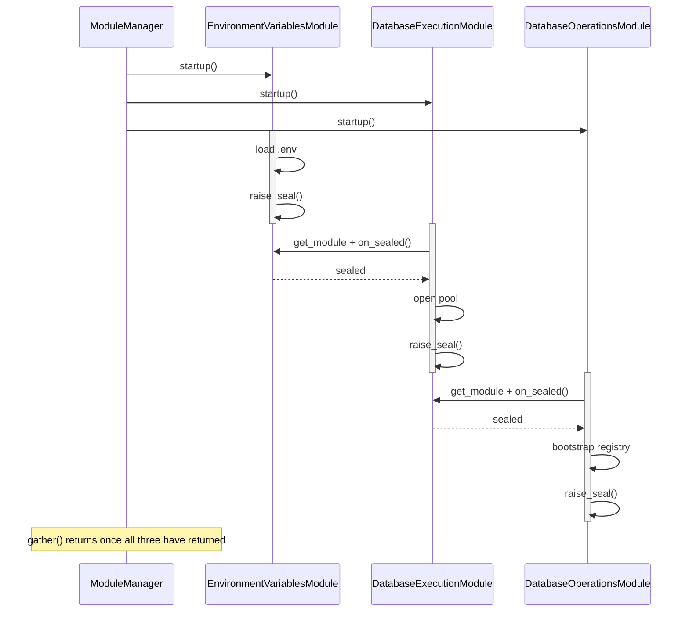
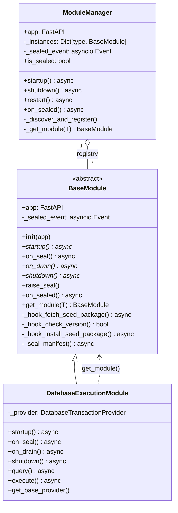
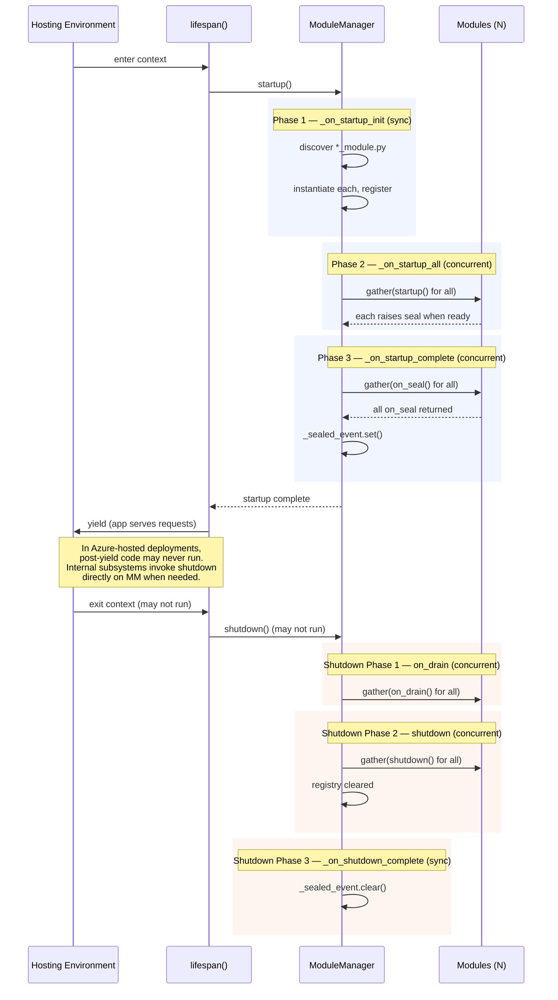
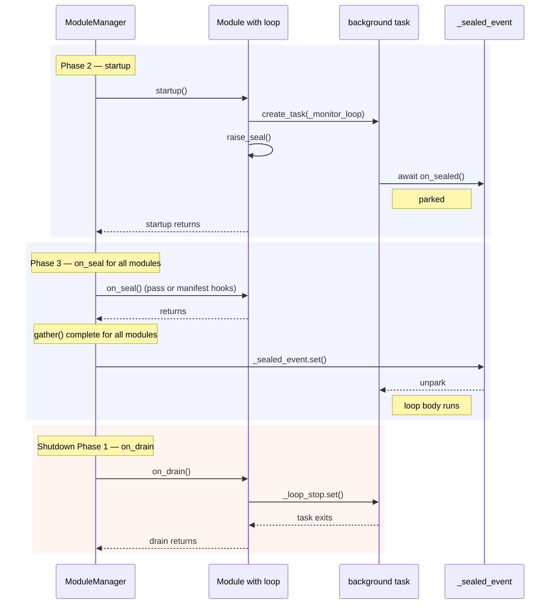
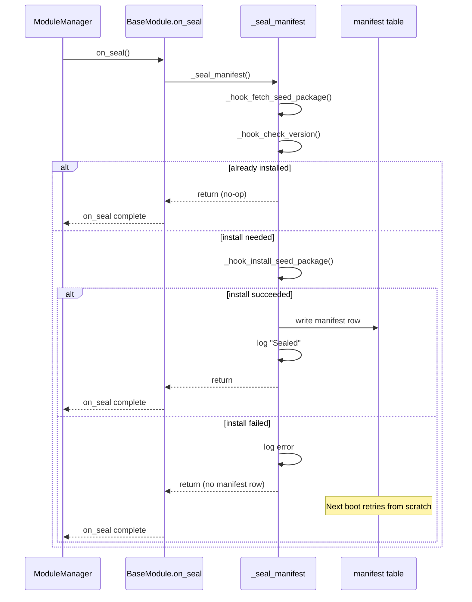
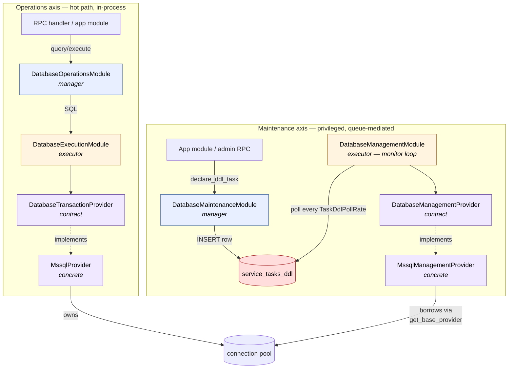
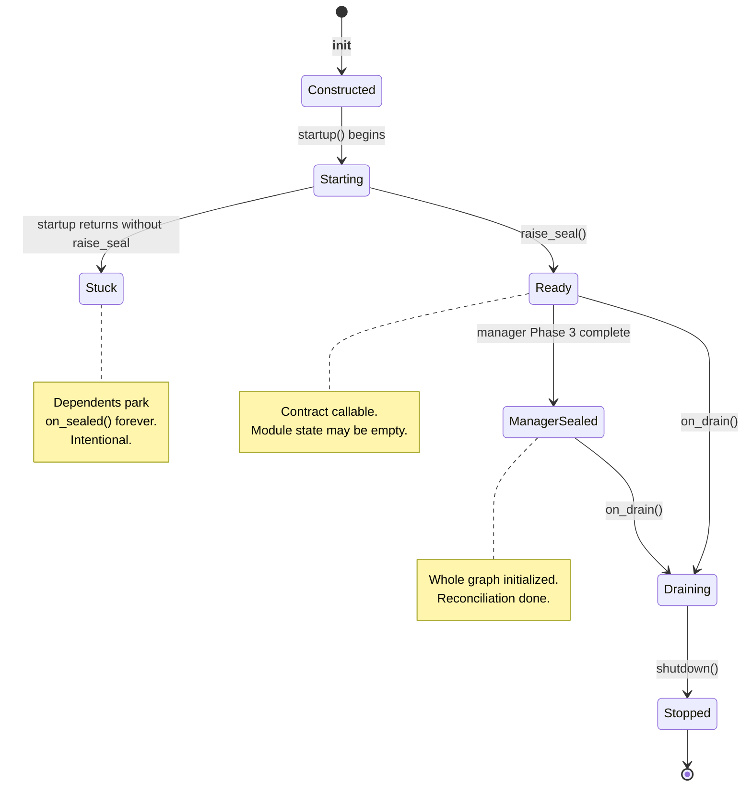

# Module Lifecycle

**Product:** TheOracleRPC
**Codename:** Unity (this iteration's rebuild; used throughout this document)

**Spec document — `docs/module_lifecycle.md`**
**Status:** authoritative reference. Supersedes header docstrings in `server/kernel/__init__.py` where they disagree.

---

## 1. Overview

Unity is TheOracleRPC's lifecycle engine. The Python code is thin;
applications are rows in a database. A **module** is a Python class implementing a fixed
contract, autodiscovered at startup, registered by its class type, and
driven through a defined set of phases by the **ModuleManager**.

The manager knows nothing about what any module does. It only calls the
contract. Modules do not know which transport invoked them, which
module called them, or what the application is — they know their own
data and their declared dependencies, and nothing else.

This document defines the contract, the phases, and the disciplines a
module author must follow. Everything else — providers, RPC, security,
database pattern specifics — belongs in other specs and is referenced
here only where the lifecycle touches it.

---

## 2. Why the ModuleManager is Unity's lifecycle layer, not FastAPI's

Unity deploys into environments (Azure App Service, among others) where
the ASGI lifespan is hoisted into a hosting wrapper that may or may not
honour the post-`yield` half of the lifespan context manager. Shutdown
code placed in a `finally:` block after `yield` is not guaranteed to
run. This is a property of the host, not a bug.

The module system is designed around that reality:

- The lifespan is a **wake signal**, nothing more. It calls
  `ModuleManager.startup()` and then yields. That is its entire role.
- The **ModuleManager owns the lifecycle**. Startup, seal, drain,
  shutdown, and `restart()` are all methods on the manager and can be
  invoked by any internal subsystem — a maintenance operation, a
  reconfiguration RPC, a test harness — not just by the lifespan.
- Nothing outside the manager sequences modules. The lifespan does not
  know how many modules exist, what they depend on, or what order they
  start in. It knows one method: `startup()`.

In plain terms: the lifespan brings the app up. The manager runs the
app. Anything that wants to stop, restart, or reconfigure a module
talks to the manager.

---

## 3. The voluntary instantiation graph

All modules are instantiated synchronously during Phase 1 and then
started **concurrently** in Phase 2 via `asyncio.gather`. The manager
does not sequence them.

Ordering emerges from a **consent-based protocol** that every module
participates in:

- A module that needs another module calls `self.get_module(T)` to
  obtain a reference, then `await dep.on_sealed()` to wait until that
  dependency's own `startup()` has finished.
- A module signals its own readiness by calling `self.raise_seal()` at
  the end of its `startup()`. That sets an internal event; every
  dependent currently parked on `on_sealed()` unblocks.

This forms a dynamic dependency graph at runtime. The manager never
sees it. No one declares it. Two rules govern it:

1. **The graph must be a DAG.** Two modules that each await the other's
   `on_sealed()` will deadlock silently. This is a code error that seed
   data and graph review prevent in practice.
2. **Every successful exit from `startup()` must call `raise_seal()`.**
   A module that exits without sealing leaves every dependent hanging.
   This is the intended failure mode when a module cannot start — its
   contract is not usable and the system refuses to proceed without it.

The terminology is deliberate. "Seal" marks transitions of state:

| Term | Scope | Meaning |
|---|---|---|
| `raise_seal()` | module | *Module* has finished `startup()` and is open for use. |
| `on_sealed()` | module | Wait until some other module has raised its seal. |
| `on_seal()` | module | Phase-3 hook on every module where post-init work runs. |
| `on_sealed()` | manager | Wait until the whole manager has reached Phase 3 completion. |
| `is_sealed` | manager | Synchronous read of the manager's sealed state. |

Module-sealed and manager-sealed are **different scopes**. A module is
sealed the moment it calls `raise_seal()`. The manager is sealed only
after every module's `on_seal()` hook has returned.

`on_sealed()` is deliberately overloaded across the two scopes: same
verb, same semantics ("park until the relevant seal event fires"),
different object. At call sites the two are unambiguous —
`await dep.on_sealed()` is per-module, `await self.module_manager.on_sealed()`
is per-manager. A single event type backs each; see §8 for the
underlying state model.

### Diagram: concurrent startup with dependency waits

Three modules, all dispatched in the same `gather` call. The manager
does no sequencing. Ordering emerges from the `on_sealed()` waits.



Nothing in the manager sequences these. `A` happens to seal first
because it has no dependencies; `B` parks on `A.on_sealed()` and resumes
the moment `A` raises its seal; `C` parks on `B`. The manager sees only
a `gather` that returns when all three tasks complete.

---

## 4. The BaseModule contract

`BaseModule` is an ABC that every `*_module.py` file's class inherits.
The contract is five lifecycle methods plus the dependency-resolution
helpers.

### 4.1 Lifecycle methods

| Method | Sync/Async | Abstract? | Phase | Purpose |
|---|---|---|---|---|
| `__init__(self, app)` | sync | no | Phase 1 | Initialize empty state. No async work. No dependency resolution. |
| `startup(self)` | async | **yes** | Phase 2 | Resolve dependencies, load data, open resources, `raise_seal()`. |
| `on_seal(self)` | async | no (default: `_seal_manifest`) | Phase 3 | Post-init work — reconciliation, manifest install, monitor loops. |
| `on_drain(self)` | async | **yes** | Shutdown Phase 1 | Stop accepting work. Release external holds. Drain in-flight. |
| `shutdown(self)` | async | **yes** | Shutdown Phase 2 | Teardown. Clear state. Close resources. |

The three abstract methods (`startup`, `on_drain`, `shutdown`) must be
implemented on every concrete module even if the body is `pass`. This
is enforced by `abc.ABCMeta` — instantiation fails at import time if
one is missing.

### 4.2 Dependency-resolution helpers

| Method | Sync/Async | Purpose |
|---|---|---|
| `get_module(T)` | sync | Returns the registered instance of module type `T`, or `None`. |
| `on_sealed(self)` | async | Awaits this module's seal event. Called by *dependents*. |
| `raise_seal(self)` | sync | Sets this module's seal event. Called by *this module*. |

`get_module` is called on `self` but returns another module's instance:

```python
db = self.get_module(DatabaseExecutionModule)
await db.on_sealed()
```

That pattern — `get_module` then `on_sealed` — is the entire dependency
protocol. Every dependency is declared this way, every time.

### 4.3 Explicit rule: `__init__` does nothing async

The manager instantiates every module synchronously in Phase 1 before
any module has started. At that point no dependency exists. An
`__init__` that called `get_module()` or `on_sealed()` would either
crash (no other instances registered yet) or deadlock (no event loop
running). Every reference to another module is obtained in `startup()`.

### Diagram: class relationships



Concrete modules inherit from `BaseModule`. The manager holds a
registry of module instances keyed by class type. Concrete modules
reach back through the manager via `get_module()` to find each other —
the dotted arrow is a *runtime* dependency, not a compile-time one.

---

## 5. ModuleManager phases

`ModuleManager.startup()` runs three phases. `shutdown()` runs three
more. Each phase is a clearly named private method on the manager.

### 5.1 Startup

| Phase | Method | Sync/Async | Concurrency | Work |
|---|---|---|---|---|
| 1 | `_on_startup_init` | sync | sequential | Discover `*_module.py` files, import, instantiate, register by class type. |
| 2 | `_on_startup_all` | async | concurrent (`gather`) | Every module's `startup()` runs in parallel. |
| 3 | `_on_startup_complete` | async | concurrent (`gather`) | Every module's `on_seal()` runs in parallel. On completion, `_sealed_event.set()`. |

### 5.2 Shutdown

| Phase | Method | Sync/Async | Concurrency | Work |
|---|---|---|---|---|
| 1 | `_on_shutdown_init` | async | concurrent (`gather`) | Every module's `on_drain()` runs in parallel. |
| 2 | `_on_shutdown_all` | async | concurrent (`gather`) | Every module's `shutdown()` runs in parallel. Registry cleared. |
| 3 | `_on_shutdown_complete` | sync | sequential | `_sealed_event.clear()`. Manager is now unsealed. |

### 5.3 Restart

`ModuleManager.restart()` iterates the registry and calls
`_restart(module_type)` on each, one at a time:

1. `await instance.shutdown()` on the existing instance.
2. Construct a new instance of the same class, bound to the same app.
3. Replace the registry entry.
4. `await new_instance.startup()`.

Restart is **serial**, not concurrent. The existing graph is torn down
module-by-module in registry iteration order and rebuilt the same way.
The manager's `_sealed_event` is not touched by `restart()` — a
per-module restart is a targeted refresh, not a system-level event,
and background loops in other modules continue to observe a sealed
manager throughout. Full-system restart runs through `shutdown()` /
`startup()` instead, which clears and re-raises the event through the
normal phase boundaries.

> **Implementation note.** `restart()` currently iterates modules in
> registry insertion order. A module that depends on another module
> still works because the dependency will have been restarted already
> (having been inserted earlier) or will restart after (and the
> current module's new `startup()` will park on its `on_sealed()`
> until it does). Restart does not bypass the seal protocol.
>
> A restarted module gets a fresh `_sealed_event` on its new instance.
> Dependents that resolved references during their own startup still
> hold those references and continue calling the module's contract;
> they do not re-enter `on_sealed()`. The contract is stable across
> the restart even though the underlying event object is not.

### 5.4 Autodiscovery rules

Phase 1 scans `server/kernel/` and, for every file matching
`*_module.py`:

1. Strip the `.py` suffix to get the file stem.
2. Convert the stem to PascalCase via `snake_to_pascal`.
3. Import the file as a submodule.
4. Look up a class by the PascalCase name.
5. Instantiate it, passing `app`.
6. Register in `self._instances[module_class] = instance`.

File `database_execution_module.py` must contain class
`DatabaseExecutionModule`. If the class is missing, the manager logs
an error and skips that file. Other modules continue.

### Diagram: full lifecycle



---

## 6. The seal phase and the self-manifest flow

Phase 3 exists to let modules confirm their own application state after
every module is available. Concretely: seed data is present, the
module's version matches the code, any migrations have run, any
monitor loops have started. Work that could not run in `startup()`
because it needed another module to be available goes here.

### 6.1 The `on_seal` default

`BaseModule.on_seal()` is not abstract. It has a default
implementation that calls `_seal_manifest()`, which runs a three-hook
chain:

| Hook | Default | Purpose |
|---|---|---|
| `_hook_fetch_seed_package(self)` | `pass` | Retrieve the module's install payload (wheel, archive, rows, whatever). |
| `_hook_check_version(self) -> bool` | `return True` | Return `True` if already installed at the current version. |
| `_hook_install_seed_package(self)` | `pass` | Install the payload. Idempotent on retry. |

Control flow inside `_seal_manifest`:

1. Call `_hook_fetch_seed_package()`.
2. Call `_hook_check_version()`. If `True`, return. Nothing to do.
3. Otherwise, call `_hook_install_seed_package()` inside a
   `try/except`. Log and return on failure; no manifest row is written,
   so the next boot retries from scratch.
4. On clean install, write the manifest row and log `Sealed`.

A module that ships seed data overrides the three hooks. It does not
override `on_seal()` itself.

### 6.2 Implementing `on_seal`

A module that ships a seed package overrides the three hooks:

```python
async def _hook_fetch_seed_package(self):
  # fetch rows from the module's wheel/archive
  ...

async def _hook_check_version(self) -> bool:
  # return True if manifest shows current version installed
  ...

async def _hook_install_seed_package(self):
  # write rows, declare tables, whatever
  ...
```

A module with no install state overrides `on_seal` with `pass`.

Operational work — background loops, listeners, schedulers — does not
go here. It goes in `startup()` and is covered in §6.3.

### 6.3 Operational work and the manager-sealed wait

Some modules run long-lived background work: monitor loops, task
pollers, bot listeners, accept loops. These must not start firing
until the whole application is up — they may call into other modules,
or depend on state that other modules seed during Phase 3.

The pattern:

1. **Create the task in `startup()`.** All of a module's "come alive"
   work lives in one place.
2. **The task's first line awaits `self.module_manager.on_sealed()`.**
   This parks the task until Phase 3 completes for every module. From
   that point on the application is fully initialized and every
   module's contract is guaranteed callable.
3. **`on_drain()` signals the task to stop** and awaits its completion.

```python
async def startup(self):
  # resolve deps, compose, prepare state
  self._loop_task = asyncio.create_task(self._monitor_loop())
  self.raise_seal()

async def _monitor_loop(self):
  await self.module_manager.on_sealed()
  logger.info("Monitor loop started")
  while not self._loop_stop.is_set():
    # do work
    ...

async def on_drain(self):
  self._loop_stop.set()
  if self._loop_task is not None:
    await self._loop_task
    self._loop_task = None
```

The task is **created** in Phase 2 but does not **run** real work
until Phase 3 completes — `asyncio.create_task` schedules it on the
event loop; its first `await` yields control back; execution resumes
only when `_sealed_event` is set. From the loop's perspective, "the
application is live" is an unconditional precondition.

This pattern generalizes. Any module that provides a live service
(bot command listener, IoGateway accept loop, scheduled job runner)
follows the same shape: task created in `startup()`, body gated on
`manager.on_sealed()`, stopped in `on_drain()`.

### Diagram: operational loop across phases



### Diagram: `_seal_manifest` hook chain



Idempotency is a property of the hooks, not the manifest. Failed
installs write nothing and retry on next boot. Successful installs
write a row and skip on next boot.

---

## 7. The six-module database access pattern

The database subsystem is the first instance of a generalized pattern
that Unity uses for every privileged or I/O-heavy subsystem: the
**Manager / Executor / Provider** model.

| Role | Purpose |
|---|---|
| **Manager** | Public API for a category of work. Accepts requests. |
| **Executor** | Takes requests from the manager and runs them through a provider contract. |
| **Provider** | Abstract contract implemented by one concrete class per backend. |

The database subsystem splits this model along two axes, for two
different categories of work:

| Axis | Manager (public API) | Executor | Provider contract | Concrete |
|---|---|---|---|---|
| **Operations** (hot path) | `DatabaseOperationsModule` | `DatabaseExecutionModule` | `DatabaseTransactionProvider` | `MssqlProvider` |
| **Maintenance** (privileged) | `DatabaseMaintenanceModule` | `DatabaseManagementModule` | `DatabaseManagementProvider` | `MssqlManagementProvider` |

Six modules total. Two providers. One shared connection pool.

The operations axis is the normal request path. `DatabaseOperationsModule`
exposes `query(DBRequest)` and `execute(DBRequest)`. It calls
`DatabaseExecutionModule` directly; `DatabaseExecutionModule` routes
to the concrete provider. All in-process, all synchronous in the usual
sense (one `await` per hop, no queuing). Callers that need the
database — RPC handlers, application modules — talk to
`DatabaseOperationsModule`. They never talk to the executor or the
provider.

The maintenance axis is the privileged path. It is **never called
directly** by application code. The flow is:

1. `DatabaseMaintenanceModule.declare_ddl_task(...)` writes a row into
   the `service_tasks_ddl` table.
2. `DatabaseManagementModule` runs a monitor loop (cadence from
   `TaskDdlPollRate` config) that polls the task table.
3. The loop picks up pending tasks, dispatches them through
   `DatabaseManagementProvider`, updates the row status.

The task table is a **boundary**. Maintenance and management do not
share in-process calls. Maintenance declares intent; management
discovers it on its own cadence. Consequences:

- Maintenance cannot race against management.
- Management cannot be invoked outside its configured poll rate.
- Restarts are safe: pending tasks survive; running tasks either
  complete or are re-picked up on next boot.
- DDL decisions are always queueable and auditable.

The two providers share the connection pool. `DatabaseExecutionModule`
owns the pool. `DatabaseManagementModule`, in its `startup()`, calls
`exec_mod.get_base_provider()` to borrow the live
`DatabaseTransactionProvider` and composes a `DatabaseManagementProvider`
over it. The management provider does not own a second pool — it uses
the execution provider's pool through the composed contract. (See
`docs/provider_composition.md` for the mechanics.)

### Explicit rule

**Management-axis modules are never called directly by application
code.** Access is always mediated by the task table. Callers declare
intent; the management loop picks it up on its own cadence. This
boundary is load-bearing and will generalize to other privileged
subsystems later.

### Diagram: the two axes



---

## 8. Ready state, sealed state, drained state

Three distinct flags govern a module's position in its lifecycle.
They are not synonyms.

| Flag | Scope | Set when | Observable via |
|---|---|---|---|
| **Module-sealed** | per module | `startup()` calls `raise_seal()` | `await dep.on_sealed()` |
| **Manager-sealed** | whole manager | every module's `on_seal()` hook has returned | `manager.is_sealed` / `await manager.on_sealed()` |
| **Drained** | per module | `on_drain()` has returned | not externally observable; modules track internally |

### 8.1 Module-sealed means "contract is usable"

A module is sealed the moment it calls `raise_seal()`. That does not
mean the module has data, or has seeded anything, or has finished
every possible initialization. It means the module's public contract
can be called without crashing.

`DatabaseOperationsModule` raises its seal even when the ops table is
empty and the registry cache has zero entries — the contract
(`query`/`execute`) is still correct, it just returns `None` for every
unknown op. "Sealed" is about the contract, not about content.

### 8.2 Manager-sealed means "application state is reconciled"

After every module has passed Phase 3, the manager sets its
`_sealed_event`. This is the higher-order guarantee: not only is
every contract usable, every module has also confirmed its
application state — seed data present, manifest row written,
reconciliation complete.

The single event backs two access modes:

- **`manager.is_sealed`** is a synchronous, non-blocking property
  that returns `True` if the event has been set. Use this when a
  module needs to *check* state without waiting — typically to reject
  work that shouldn't run before the app is live:

  ```python
  def submit_ddl(self, spec):
    if not self.module_manager.is_sealed:
      logger.error("Refusing DDL: app not yet sealed")
      return None
    # ...
  ```

- **`await manager.on_sealed()`** parks until the event fires. Use
  this in background tasks that shouldn't start running until the app
  is fully up:

  ```python
  async def _monitor_loop(self):
    await self.module_manager.on_sealed()
    # app is live; proceed
  ```

Two surfaces, one state. `is_sealed` is the `Event.is_set()` read;
`on_sealed()` wraps `Event.wait()`. The manager never stores a
separate bool.

### 8.3 The deadlock is a feature, not a bug

A module that exits `startup()` without calling `raise_seal()` leaves
its dependents parked on `on_sealed()` forever. The app hangs with a
log entry from the failing module. This is the **designed failure
mode** — it tells the operator that a module's dependency set was not
satisfied and that the system refuses to run without it. Seed data
and graph review prevent it in production. In development, it surfaces
real problems quickly.

Do not dress this up with timeouts or fallbacks. A module that cannot
start is a module whose contract is not safe to call. The rest of the
graph stopping is the correct response.

### Diagram: module state machine



---

## 9. Writing a new module — the skeleton

A minimal module has:

- A filename ending `_module.py` in `server/kernel/`.
- A class named with the PascalCase of the filename.
- Inheritance from `BaseModule`.
- Module-scoped logger using the current convention.
- All three abstract methods implemented (even as `pass`).
- A deliberate choice about `on_seal`.

```python
import logging
from fastapi import FastAPI

from . import BaseModule
from .environment_variables_module import EnvironmentVariablesModule

logger = logging.getLogger(__name__.split('.')[-1])


class ExampleModule(BaseModule):
  def __init__(self, app: FastAPI):
    super().__init__(app)
    self._cache: dict = {}

  async def startup(self):
    env = self.get_module(EnvironmentVariablesModule)
    await env.on_sealed()

    # resolve other deps, load data, open resources...

    self.raise_seal()

  async def on_seal(self):
    pass            # override the three hooks instead if shipping seed data

  async def on_drain(self):
    pass

  async def shutdown(self):
    self._cache.clear()
```

This is not a template to paste; the explicit method stubs are
deliberate reminders of the contract. Operational work (monitor
loops, listeners) goes in `startup()` per §6.3, not in `on_seal()`.

---

## 10. Positive-framed rules

The rules below are the distilled discipline of the module pattern.
They are invariants, not suggestions. Violations lead to hangs, silent
failures, or subtle ordering bugs that do not reproduce reliably.

1. **Resolve dependencies in `startup()`, never in `__init__`.**
   `__init__` runs synchronously in Phase 1 before any module has
   started. Dependency references belong in `startup()`.

2. **Call `raise_seal()` on every successful exit from `startup()`.**
   A module that does not seal is intentionally unavailable and will
   hang its dependents. Leaving a module unsealed is a valid design
   choice; leaving it unsealed by accident is a bug.

3. **Declare every module you directly use.**
   Transitive readiness — "module C is ready because module B is ready
   and B depends on A" — is brittle and wrong. If your module calls
   into `A`, you depend on `A`, and you resolve `A` explicitly.

4. **Implement `on_seal` for your install state, not for operational work.**
   Override the three hooks when you ship a seed package. Override
   `on_seal` with `pass` when you have no install state. Operational
   work goes in `startup()`, not `on_seal()` — see rule 8.

5. **Implement every abstract method, even as `pass`.**
   `startup`, `on_drain`, `shutdown` are abstract. `abc` enforces
   their presence at import time. A missing method is not an oversight
   the manager will forgive.

6. **Stay inside your module's contract.**
   Call other modules through their public methods. Never reach into
   private attributes (`_foo`), never touch another module's cache
   directly, never bypass a contract because you know the
   implementation. The contract is the entire agreement between
   modules.

7. **Let the deadlock happen.**
   A module that cannot start has surfaced a missing piece of
   platform state. The correct fix is seeding the state, not making
   the dependency wait weaker. Timeouts and fallbacks on `on_sealed()`
   would hide the signal.

8. **Gate operational work on `manager.on_sealed()`; gate sync
   rejection on `manager.is_sealed`.**
   Background loops, listeners, and schedulers start as tasks in
   `startup()` and the task's first line awaits
   `self.module_manager.on_sealed()`. That guarantees the whole
   graph is up before the loop body runs. For synchronous rejection
   of work that mustn't execute before the app is live — typically in
   a public method of a privileged module — read `self.module_manager.is_sealed`
   and return early if it's false.

9. **Write `shutdown` assuming `on_drain` has completed.**
   Drain releases holds and signals in-flight work to finish. Shutdown
   tears down what drain left. Do not duplicate drain work in
   shutdown, and do not assume shutdown runs after every drain — the
   host may kill the process between phases.

10. **Put dependency waits at the top of `startup()`.**
    Every `get_module` + `await on_sealed()` pair happens before any
    real work in `startup()`. This makes the dependency surface
    visible in the first few lines of every module.

---

## 11. Known gaps and cosmetic issues

- **Header docstrings in `server/kernel/__init__.py` reference the
  pre-rename names (`mark_ready`, `on_ready`) in several places.** LSP
  rename does not touch comment text. This spec is authoritative; the
  comments should be aligned to it on the next touch of that file.
- **No circular-dependency detection.** Two modules that each await
  the other's `on_sealed()` will deadlock silently. This is intentional
  (see rule 7). The graph's shape is reviewed, not policed.
- **The seed-package hooks have no-op defaults.** Until modules begin
  shipping real seed packages, `_hook_check_version` returning `True`
  means most `_seal_manifest` invocations complete without side
  effects. The machinery is in place; content follows.

---

## Appendix: Quick reference

### Contract method cheat sheet

```
__init__(app)     sync   Phase 1       initialize empty state, no async
startup()         async  Phase 2       resolve deps, load data, raise_seal()
on_seal()         async  Phase 3       post-init; default runs _seal_manifest
on_drain()        async  shutdown 1    stop accepting work
shutdown()        async  shutdown 2    teardown, clear state
```

### Dependency protocol

```python
dep = self.get_module(DependencyModule)   # sync, returns instance
await dep.on_sealed()                     # async, parks until dep.raise_seal()
# ... use dep ...
self.raise_seal()                         # sync, unblocks our own dependents
```

### Seal vocabulary

| Verb | Scope | Who calls it | What it does |
|---|---|---|---|
| `raise_seal()` | module | the module itself, once | sets the module's seal event |
| `on_sealed()` | module | dependents, many times | awaits the module's seal event |
| `on_seal()` | module | the manager, once | runs Phase 3 hook |
| `on_sealed()` | manager | background tasks | awaits the manager's seal event |
| `is_sealed` | manager | public methods, sync reads | reads the manager's seal event |
| `_sealed_event` | manager | manager only | backing `asyncio.Event` — set in Phase 3, cleared on shutdown |
