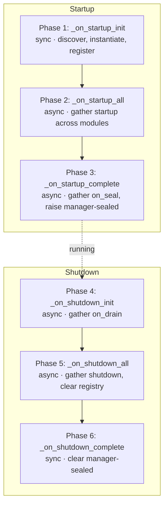

# Module Lifecycle

**Product:** TheOracleRPC
**Codename:** Unity

**Spec document — `docs/module_lifecycle.md`**
**Status:** authoritative reference for the module lifecycle contract.

---

## 1. Purpose and scope

Every module in Unity — kernel, core, application, extension —
participates in a single lifecycle contract defined by `BaseModule`.
This document specifies that contract: the lifecycle phases, the
contract methods modules implement, the seal protocol that sequences
dependencies, the `ModuleManager` that drives it, and the `BaseWorker`
contract for long-running loops owned by modules.

Lifecycle is universal. It is not specific to the kernel tier. A
kernel module, a core module, an application module, and an
extension module all implement the same five contract methods,
participate in the same phases, and resolve dependencies through the
same seal protocol. Tiering (kernel / core / application / extension)
governs what a module *does* and what it *depends on*; lifecycle
governs how it *starts, runs, and stops*, and that is the same for
all of them.

The Manager/Executor/Provider pattern that some modules participate
in is covered in `kernel_architecture.md`. Provider composition is
covered in `provider_composition.md`. This document is about
lifecycle only.

---

## 2. What a module is

A module is a Python class derived from `BaseModule`, living in a
file matching the pattern `*_module.py`. The `ModuleManager`
autodiscovers these files at startup: it scans the kernel modules
folder (and, in time, the core and application folders), converts
each filename to a PascalCase class name (`database_execution_module.py`
→ `DatabaseExecutionModule`), imports the file, instantiates the
class, and registers the instance by type.

Three properties follow from autodiscovery:

**Modules are singletons per class.** The manager holds one instance
per registered class. Dependency lookups (`get_module(Type)`) return
the same instance to every caller.

**Module registration is implicit.** A module registers itself by
existing in the right folder with the right filename. There is no
decorator, no registry file, no explicit import list. Adding a
module to the system is a matter of dropping the file in place; the
manager picks it up on the next boot.

**The class name must match the filename.** Conversion is strict:
`snake_to_pascal` on the filename stem must produce the class name.
Mismatches are logged and skipped.

---

## 3. The lifecycle contract

Every module implements five contract methods. Three are abstract
and must be overridden; two have default behavior that can be used
as-is or overridden.

| Method | Phase | Abstract | Purpose |
|---|---|---|---|
| `__init__(app)` | 1 | implicit | Sync construction. Initialize empty caches, null references. No async work, no dependency resolution. |
| `startup()` | 2 | yes | Async. Resolve dependencies, load data, open resources, `raise_seal()`. |
| `on_seal()` | 3 | no | Async. Post-init work. Default runs manifest-seal hook chain (§6). |
| `on_drain()` | 4 | yes | Async. Pre-shutdown signal. Stop accepting work, flush in-flight operations. |
| `shutdown()` | 5 | yes | Async. Teardown. Clear caches, close resources, null references. |

The phases run in strict order across the module set. Within a
phase, all modules run concurrently.

---

## 4. Phase-by-phase behavior

The `ModuleManager` drives the phases. Its own `startup()` and
`shutdown()` methods are composed of sub-phases that each fan out
across the registered module set.

### 4.1 Startup phases

**Phase 1 — `_on_startup_init` (sync).** The manager discovers
`*_module.py` files, imports each, instantiates the expected class,
and registers it in the instance map keyed by class type. Module
constructors run here. No async work occurs in this phase; it is
fully synchronous so that every module exists before any module's
async lifecycle begins. By the end of Phase 1, the full instance
registry is populated.

**Phase 2 — `_on_startup_all` (async, concurrent).** The manager
calls `startup()` on every module concurrently via
`asyncio.gather`. Modules resolve their dependencies, load data,
open resources, and call `raise_seal()` when ready. Ordering
emerges from seal waits (§5), not from dispatch order.

**Phase 3 — `_on_startup_complete` (async, concurrent).** The
manager calls `on_seal()` on every module concurrently. This phase
is for post-init work that requires the full module graph to be
live — reconciliation, finalization, manifest sealing (§6). After
every `on_seal()` completes, the manager raises its own
`_sealed_event`, signaling manager-sealed (§5.2).

### 4.2 Shutdown phases

**Phase 4 — `_on_shutdown_init` (async, concurrent).** The manager
calls `on_drain()` on every module concurrently. This is the
pre-shutdown signal: modules stop accepting new work, flush
in-flight operations, and release external holds that should be
released before teardown. `on_drain()` is *not* teardown — it's
quiescence.

**Phase 5 — `_on_shutdown_all` (async, concurrent).** The manager
calls `shutdown()` on every module concurrently. Modules clear
caches, close pools, null references. The manager then clears the
instance registry.

**Phase 6 — `_on_shutdown_complete` (sync).** The manager clears
its own `_sealed_event`, signaling unsealed. A full shutdown/startup
cycle re-raises it through Phase 3.

### 4.3 Phase diagram



---

## 5. The seal protocol

The manager does not enforce dependency ordering between modules.
Modules sequence themselves through the seal protocol: an
asyncio-event-based handshake that lets a module declare "I am
initialized and safe to call" and lets dependents wait for that
declaration before proceeding.

The word *sealed* has two distinct scopes. Both matter, and
confusing them creates subtle startup bugs.

### 5.1 Module-sealed

A module is **module-sealed** when it has called `raise_seal()` at
the end of its own `startup()`. Dependents observe this by awaiting
`dependency.on_sealed()`.

The typical dependency pattern in `startup()`:

```python
async def startup(self):
  dep = self.get_module(SomeDependencyModule)
  await dep.on_sealed()
  # … use dep's contract safely here …
  self.raise_seal()
```

`get_module()` returns the dependency's instance from Phase 1's
registration — the instance always exists by the time Phase 2 runs.
What it may not have done yet is finished its own `startup()`;
`await dep.on_sealed()` parks until it has.

`raise_seal()` is a one-way transition. There is no `lower_seal()`.
Once a module signals sealed, it remains sealed for the remainder of
the phase sequence. A module that fails to reach a workable state
may return from `startup()` *without* calling `raise_seal()`,
leaving the event unset; dependents awaiting that seal will park
indefinitely. This is the intentional signaling mechanism for
"this module could not initialize" — see §8.

Backed by: `BaseModule._sealed_event` (one per module instance).

### 5.2 Manager-sealed

The system is **manager-sealed** when every module has completed
`on_seal()` — that is, when Phase 3 has finished. The manager's own
`_sealed_event` is raised at that point.

Module code observes manager-sealed in two ways:

- **Sync read** via the `is_sealed` property on the manager. Useful
  for diagnostic paths or for request handlers checking readiness.
- **Async wait** via `await self.module_manager.on_sealed()`. This
  is the canonical pattern for *operational work* — long-running
  loops owned by modules (workers, monitors, pollers) whose first
  statement is a wait on manager-sealed so they do not begin
  processing until the full graph is live.

Backed by: `ModuleManager._sealed_event` (one per manager).

### 5.3 Why two scopes

Module-sealed answers "is this specific module's contract safe to
call?" and is the coordination primitive between modules during
`startup()`. Manager-sealed answers "is the whole application
ready?" and is the coordination primitive for operational work that
needs the full graph.

A module that begins its monitor loop during its own `startup()`
waits on manager-sealed before doing any work — otherwise the loop
might dispatch calls into modules that are themselves still sealing.
A module resolving a dependency in `startup()` waits on the
dependency's module-seal — not manager-seal — because manager-seal
hasn't been raised yet in Phase 2, and using it would deadlock.

Both events are in-memory only. A full shutdown/startup cycle
clears and re-raises them through Phase 6 and Phase 3.

---

## 6. `on_seal()` and the manifest-seal hooks

`on_seal()` has a default body. Unlike the other async contract
methods, it is not abstract — `BaseModule.on_seal()` is implemented
and runs a three-hook chain that handles module installation
sealing against `service_modules_manifest`.

A module may:

- **Leave the default in place.** The default walks the hook chain.
  For a module that doesn't contribute to the manifest, the hooks'
  default bodies do nothing and the chain is a no-op.
- **Override with a pass.** A module that has post-init work to
  skip *and* doesn't want the manifest chain either writes
  `async def on_seal(self): pass`. Many modules do this — the
  manifest seal is opt-in by leaving the default.
- **Override and call `super().on_seal()`.** A module doing its own
  post-init work alongside the manifest chain calls the parent and
  adds its own work.

The three hooks, in order:

**`_hook_fetch_seed_package()`** — Default does nothing. An
overriding module loads its install manifest (version, DDL
declarations, seed data) from wherever the module owns it.

**`_hook_check_version()`** — Default returns `True`. Return `True`
to indicate the module is already at its current version and no
install is needed; the chain exits without running the install
hook. Return `False` to trigger installation.

**`_hook_install_seed_package()`** — Default does nothing. An
overriding module performs the actual install work: declaring DDL
tasks for its tables, inserting seed rows, writing a
`service_modules_manifest` row with `pub_is_sealed = 1` on success.

The chain catches exceptions from `_hook_install_seed_package()`,
logs them, and returns without re-raising. A failed install leaves
the manifest row unsealed (or absent), and the module retries on
next boot. This is the idempotent retry-from-scratch pattern the
foundation migration's `service_modules_manifest` table is designed
for.

Full install-package mechanics — manifest schema, seed-package
layout, versioning, rollback semantics — are deferred to a future
`module_installation.md`. This document specifies only that the
hooks exist and what their contract is within the lifecycle.

---

## 7. Operational work: loops owned by modules

Many modules own long-running work — poll loops, monitor tasks,
schedulers, workers. These are started during the owning module's
`startup()` and stopped during its `on_drain()` or `shutdown()`.

The canonical pattern:

```python
async def startup(self):
  # … resolve dependencies, construct worker …
  self._worker = SomeWorker(self.module_manager, …)
  await self._worker.start()
  self.raise_seal()

async def on_drain(self):
  if self._worker is not None:
    await self._worker.stop()

async def shutdown(self):
  self._worker = None
```

The worker's loop begins as a background task during `start()`, but
its first statement inside the loop body is
`await self._module_manager.on_sealed()`. This parks the loop until
manager-sealed is raised at the end of Phase 3. Without this wait,
the worker could dispatch calls into modules still finishing their
own `startup()` or `on_seal()`, which breaks the contract that
module-sealed means the module's methods are safe to call.

This is the operational-work gating rule: **loops owned by modules
wait on manager-sealed before doing any work**, even though the
loop task itself is spawned during `startup()`.

`on_drain()` signals the loop to stop and awaits its completion.
The loop finishes its current iteration's in-flight work, then
exits. No task is interrupted mid-iteration. `shutdown()` clears
the worker reference.

---

## 8. Failure behavior

A module whose `startup()` cannot complete successfully has one
option: return from `startup()` without calling `raise_seal()`. The
module-sealed event stays unset. Dependents that await its seal
park indefinitely — the system is in a half-started state where
the module is registered but its contract is not usable.

This is intentional. Startup failure is not a panic; it is a signal
that propagates through the seal protocol. A dependent that parks
on an unsealed module is surfacing the dependency chain: the log
will show which module failed to seal, and every downstream module
will be visibly stuck waiting for it.

The manager does not time out seal waits, does not cancel parked
modules, and does not abort startup on individual module failure.
Phase 2's `asyncio.gather` runs every module's `startup()` to its
own termination; modules that succeeded continue to run, modules
that parked stay parked. Phase 3 attempts `on_seal()` on every
module regardless of whether Phase 2 cleanly sealed every one.

The practical consequence: a broken module cascades visibly, and
recovery is a code fix plus a restart. There is no partial-recovery
mechanism in the lifecycle itself.

Exceptions raised from `startup()`, `on_seal()`, `on_drain()`, or
`shutdown()` bodies propagate out of `asyncio.gather` and are
logged by the manager's phase wrappers. They do not abort the phase
for other modules.

---

## 9. Dependency graph discipline

Modules resolve dependencies implicitly through the seal protocol.
The manager does not know which module depends on which, does not
pass references, and does not enforce ordering. The dependency
graph emerges at runtime from the sequence of `get_module()` +
`await on_sealed()` calls in module `startup()` bodies.

Three rules follow.

**The graph must be a DAG.** Two modules that each await the other's
module-seal will deadlock silently. There is no runtime detection
and no timeout. This is a code error — the lifecycle offers no
recovery from it.

**Use `get_module()` to find dependencies; use `on_sealed()` to wait
for them.** `get_module()` always returns the registered instance
(or `None` if the type isn't registered, which is a code error
distinct from a dependency ordering issue). `on_sealed()` is the
wait.

**Resolve dependencies once, at the top of `startup()`.** A module
that resolves a dependency mid-`startup()` — after doing its own
initialization work — creates a subtle ordering coupling. The
canonical pattern resolves everything first, awaits seals, then
proceeds to the module's own init. This keeps the dependency graph
explicit at the start of the method body.

---

## 10. `ModuleManager` responsibilities

The `ModuleManager` has a deliberately narrow job. It:

- Discovers modules by filename convention and instantiates them
- Calls the five contract methods at the right phase
- Raises and clears its own seal event at phase boundaries
- Exposes a lookup for `BaseModule.get_module()`
- Offers a single-module restart (`restart`, §10.1) and a full
  restart sweep for live reconfiguration scenarios

It does not:

- Pass references between modules
- Know which module depends on which
- Enforce ordering beyond the phase boundaries
- Detect circular dependencies at runtime
- Retry failed startups
- Time out parked seal waits

Modules are self-sufficient. They find each other via
`get_module()`, sequence via `on_sealed()`, and signal readiness
via `raise_seal()`. The manager's job ends at invoking the contract
methods at the right phase.

This narrowness is deliberate. A manager with more responsibility
becomes the coordination point for every new dependency shape and
every new failure mode — which is the opposite of what modular
composition is for. The seal protocol is expressive enough to let
modules coordinate themselves without the manager mediating.

### 10.1 Restart

The manager exposes a restart capability for scenarios where a
module needs to be reconfigured without a full application restart —
typically reloading configuration and rebuilding a connection pool
or cache.

`restart()` iterates the full instance map and restarts each
module in turn. `_restart(module_type)` restarts a single module:
it calls the existing instance's `shutdown()`, constructs a fresh
instance of the same class, stores it in the instance map
(replacing the old one), and calls the new instance's `startup()`.
The new instance runs its own dependency resolution and seal
protocol from scratch.

Two consequences callers should be aware of:

- **Held references go stale.** Any module that resolved a
  reference to the restarted module via `get_module()` and cached
  it is still pointing at the old instance. The lifecycle does not
  propagate restart notifications. Callers that need to survive a
  peer restart should re-resolve through `get_module()` on use
  rather than caching the reference.
- **Dependents are not re-driven.** Restarting a module does not
  rerun `startup()` on its dependents. If a dependent's state
  depends on having resolved against the old instance at startup
  time, that state is now inconsistent. Single-module restart is
  appropriate for leaf modules and for modules whose dependents
  re-resolve per call.

No module or contract in the system currently calls `restart` or
`_restart`. They exist for operator-initiated live reconfiguration
when that capability is built out.

---

## 11. `BaseWorker`

A **worker** is a long-running work loop owned by a module. Workers
are not autodiscovered and do not participate in the lifecycle
contract directly — they live and die with the module that
constructs them.

The `BaseWorker` ABC defines two methods:

```python
class BaseWorker(ABC):
  @abstractmethod
  async def start(self) -> None: ...

  @abstractmethod
  async def stop(self) -> None: ...
```

`start()` spawns the loop as a background task and returns without
awaiting it. `stop()` signals the loop to stop (typically via an
`asyncio.Event`) and awaits the task's completion. The owning
module constructs the worker during `startup()`, calls `start()`,
and calls `stop()` during `on_drain()`; see §7 for the pairing with
lifecycle phases and the manager-sealed gating rule.

How workers fit into the Manager/Executor/Provider taxonomy is
covered in `kernel_architecture.md` §3.

---

## 12. Minimal module template

The simplest correct module:

```python
from fastapi import FastAPI
from . import BaseModule


class SomeModule(BaseModule):
  def __init__(self, app: FastAPI):
    super().__init__(app)
    # Initialize empty state here.

  async def startup(self):
    # Resolve dependencies, load data, open resources.
    self.raise_seal()

  async def on_seal(self):
    pass  # or `await super().on_seal()` to run manifest-seal hooks

  async def on_drain(self):
    pass

  async def shutdown(self):
    pass  # Clear caches, null references.
```

Every module implements this shape at minimum. Modules with more
responsibility fill in the method bodies; modules with dependencies
resolve them in `startup()`; modules with workers construct and
start them in `startup()` and stop them in `on_drain()`.

---

## 13. What this doc doesn't cover

The Manager/Executor/Provider subsystem pattern is covered in
`kernel_architecture.md`. This document specifies how *any* module
lives, independent of whether it participates in a subsystem.

Provider composition — the handle-borrowing between primary and
composed providers — is covered in `provider_composition.md`.
Composed providers are not modules; their lifecycle is bound to
their composing manager's lifecycle.

Install-seed-package mechanics — the concrete schema of
`service_modules_manifest`, the layout of seed packages, versioning
semantics, and install-failure recovery — are deferred to a future
`module_installation.md`. This document specifies only that the
hooks exist and what their contract is within `on_seal()`.

Per-subsystem specifications for database, auth, and iogateway
live in `database_management.md`, `auth.md`, and `iogateway.md`.

Multi-node coordination, quorum, and horizontal scaling mechanics
are out of scope here. Lifecycle is a single-process concept; the
seal events are in-memory and not replicated across nodes.

---