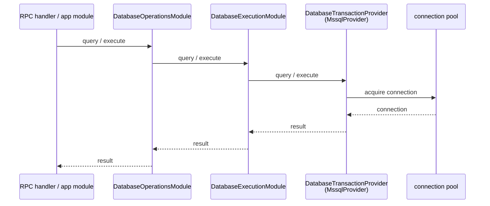
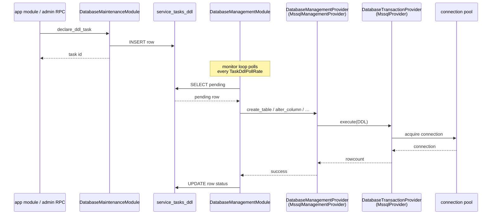

# Provider Composition

**Product:** TheOracleRPC
**Codename:** Unity

**Spec document — `docs/provider_composition.md`**
**Status:** authoritative reference for the provider layer, the
primary/composed split, and the handle-borrowing mechanism.

---

## 1. Purpose and scope

This document specifies the provider layer of Unity's kernel
architecture: the abstract contracts every provider implements, the
distinction between primary and composed providers, and the
mechanism by which a composed provider borrows a live handle from a
primary provider without owning its resource.

The Manager/Executor/Provider pattern itself is defined in
`kernel_architecture.md`; this doc zooms into the Provider row of
that pattern and shows how extension works at that layer. Subsystem
realizations — the six-module Database layout, the task queue, the
Auth provider sub-families — live in their own specs. Module
lifecycle mechanics live in `module_lifecycle.md`.

---

## 2. Primary and composed providers

Every provider is one of two kinds.

A **primary provider** owns the resource. It is constructed with the
information needed to address that resource (a DSN, a URL, a
credentials reference) and opens the resource during its `connect()`
method. The connection, client, pool, or socket lives inside the
concrete primary provider for the lifetime of its owning executor.
A subsystem has one primary provider per external resource.

A **composed provider** does not own a resource. It is constructed
with a reference to a live primary provider and layers an additional
protocol surface on top of it. Composed-provider methods dispatch
through the primary's contract — they never reach past it to the
underlying connection. A primary provider may have zero, one, or
many composed providers layered on top of it.

Database is the subsystem that demonstrates the split today.
`DatabaseTransactionProvider` is the primary contract, implemented by
`MssqlProvider`, which owns the `aioodbc` connection pool.
`DatabaseManagementProvider` is a composed contract, implemented by
`MssqlManagementProvider`, which borrows the transaction provider to
run DDL through the same pool. Two contracts, two implementations,
one pool.

Auth and IoGateway have primary contracts only today —
`AuthProvider` and `IoGatewayProvider`. Neither has a composed
contract layered on top. Composition is available to them if a
second contract surfaces over the same resource; it is not applied
preemptively.

---

## 3. Primary provider contract

A primary provider ABC has four structural elements:

**Constructor.** Takes resource-address configuration. For
`DatabaseTransactionProvider` this is a DSN string. The constructor
stores the configuration but does not open the resource — allocation
is deferred to `connect()`.

**`connect()`.** Opens the resource and stores the handle as
concrete-provider state. The ABC does not name the handle; it is an
implementation detail of the concrete class. `MssqlProvider` stores
its `aioodbc` pool as `self.pool`; a future Postgres provider would
store whatever its driver returns. Callers above the provider layer
never see the handle.

**`disconnect()`.** Closes the resource and clears the handle. Called
by the owning executor during `shutdown()`. Primary providers are
responsible for their own teardown; nothing else in the kernel
disconnects a provider's resource.

**Domain contract.** The methods that define what the provider
actually does. For `DatabaseTransactionProvider` this is `query` and
`execute`. These are the methods the executor dispatches through and
the methods a composed provider — if any — calls into.

The resource itself is not a first-class abstraction. There is no
`ConnectionPool` type, no `ResourceHandle` protocol. The resource is
whatever the concrete primary provider's backend library produces,
and it lives inside the concrete provider. Everything above the
concrete provider sees only the ABC's methods.

---

## 4. Composed provider contract

A composed provider ABC has three structural elements and, critically,
lacks one:

**Constructor.** Takes the primary provider instance as its single
argument. For `DatabaseManagementProvider` this is a
`DatabaseTransactionProvider`. The composed provider stores the
reference as private state and uses it as its dispatch target.

**Domain contract.** The methods that define the composed layer.
For `DatabaseManagementProvider` this is schema introspection
(`read_tables`, `read_columns`, …), DDL emission (`create_table`,
`alter_column`, …), and capability reporting
(`supports_online_index_rebuild`, `supports_native_vector`).

**Dispatch through the primary.** Composed-provider methods implement
their protocol by calling the primary provider's contract. A
`create_table` implementation issues DDL by calling
`self._provider.execute(sql)`. It does not touch the primary's
internal state, does not acquire the pool directly, does not bypass
any method.

The missing element is `connect`/`disconnect`. A composed provider
does not open or close anything. Its lifecycle is bound entirely to
the composing manager that constructs it; when the composing manager
tears down, the composed provider's reference is simply cleared and
garbage-collected. The primary's resource is unaffected.

---

## 5. Composition over inheritance

The composed provider takes the primary provider as a constructor
argument rather than inheriting from it. This is a deliberate choice
with four distinct concerns behind it, each sufficient on its own.

The first concern is lifecycle. A primary provider is constructed
and connected during its owning executor's `startup()`. A composed
provider is constructed later, after the composing manager has
resolved its dependencies and awaited the primary executor's seal.
If the composed provider inherited from the primary, construction
would have to reconcile two different sets of lifecycle requirements
on the same instance, and the question of when `connect()` runs
would have two answers. With composition, the primary is constructed
once by one module, and the composed provider is constructed
separately by another; each is responsible for its own lifecycle
and nothing is shared except the live handle.

The second concern is that the contracts are orthogonal. DML and DDL
are different problems with different concurrency properties,
different audit requirements, and different access controls.
Inheritance implies a subtype relationship — a management provider
*is a* transaction provider — that doesn't reflect how the two
contracts are actually used. A management provider *uses* a
transaction provider; that's composition, and saying so plainly is
clearer than encoding the relationship in a type hierarchy that
doesn't match.

The third concern is resource ownership. The primary executor owns
the pool exclusively. It opens the pool in `startup()` and closes it
in `shutdown()`. If the composed provider inherited, it would also
inherit the pool's lifecycle methods, and two modules would have
equal claim on `disconnect()`. The system would either need a
coordination protocol (awkward) or a rule that one of the two
modules must not call the inherited method (fragile). Composition
removes the question: the composed provider has no connection
methods to call because it has no resource to close.

The fourth concern is extensibility. Nothing about a primary
provider limits how many composed providers can layer on top of it.
A hypothetical future subsystem might run a management provider and
a telemetry provider simultaneously over the same transaction
provider, each composing against the same primary reference. Multiple
inheritance doesn't compose cleanly; multiple independent references
to the same primary do.

None of these four concerns are the one "real" reason. They are four
different ways of describing the same underlying fact: resource
ownership and protocol surface are separate concerns, and the
provider layer is built to keep them separate.

---

## 6. The handle handoff via `get_base_provider()`

A primary executor exposes one method to make its live primary
provider available for composition: `get_base_provider()`. On
`DatabaseExecutionModule`, this method returns the
`DatabaseTransactionProvider` instance the executor constructed and
connected during its own startup, or `None` if startup didn't
complete successfully.

Four rules govern the handoff:

**It is only callable after the primary executor has raised its
seal.** The composing manager resolves the primary executor via
`get_module(...)` and awaits `on_sealed()` before calling
`get_base_provider()`. Calling earlier would return `None` at best
(the provider field hasn't been assigned) or an unconnected instance
at worst.

**The returned reference is the live provider itself.** There is no
copy, no wrapper, no proxy. The same object the primary executor
dispatches through is the object a composed provider receives. This
matters because the primary's connection pool is reached through
that object's methods; any indirection would either defeat the
point or add coordination overhead with no benefit.

**The borrower does not disconnect.** A composing manager receives
the reference, passes it to the composed provider's constructor, and
holds no further claim on the primary's lifecycle. Nothing in the
composing manager's `shutdown()` calls `disconnect()`. The primary
executor handles teardown.

**The reference is a snapshot, not a subscription.** If the primary
executor is restarted independently — constructing a new provider
instance — any composed provider still holding the old reference
will dispatch through a stale object. This is why composed-provider
lifecycle is bound to the composing manager: any full-system or
cross-module restart recomposes everything from scratch, and there
is no supported path for a composed provider to outlive its primary.

The handoff itself is three lines inside `DatabaseManagementModule.startup()`:

```python
base = exec_mod.get_base_provider()
if base is None:
  logger.error("No base provider available")
  return
```

followed by construction of the concrete composed provider with
`base` as the sole constructor argument.

---

## 7. Startup ordering for a composing module

A composing manager's `startup()` follows a fixed order. The order
is not a convention; each step depends on the previous step having
completed.

1. Resolve the primary executor via `get_module(...)`, then await
   its `on_sealed()`. This guarantees the primary's `connect()` has
   run and its provider is live.

2. Resolve any other dependencies — configuration modules,
   environment modules — and await their seals. This is where poll
   rates, provider-selection keys, and other per-composition
   configuration become available.

3. Call `exec_mod.get_base_provider()`. Null-check the result. If
   the primary came up without a provider (bad configuration, missing
   environment variable, unknown provider name), log and return
   without sealing. The composing manager becomes intentionally
   unavailable; dependents park on its seal event.

4. Branch on configuration to select the concrete composed provider.
   Database selects on `SQL_PROVIDER`, matching the same environment
   variable the primary executor used. Construct the composed
   provider, passing the primary reference to its constructor.

5. Start any background tasks the composing manager owns. Management
   modules typically own a monitor loop; its first `await` is
   `self.module_manager.on_sealed()` per the operational-work
   pattern in `module_lifecycle.md` §6.3.

6. Call `raise_seal()`.

Teardown is symmetric but shorter. `on_drain()` signals the monitor
loop to stop and awaits its completion. `shutdown()` clears the
composed provider reference. Nothing else is needed; the primary
executor handles pool teardown on its own schedule.

---

## 8. Request flow through composed providers

Two diagrams clarify how a request reaches the resource through the
composed layer. The first shows the straight hot-path flow through
the primary only; the second shows the queue-mediated privileged
flow through the composed provider.

### 8.1 Hot-path flow through the primary provider



Four hops, all in-process. No composed provider participates.

### 8.2 Privileged flow through the composed provider



Three observations. First, the declarer's call returns as soon as
the queue row is written; the work happens later, on the monitor
loop's cadence. Second, the composed provider dispatches DDL
through the primary's `execute` method — it does not acquire the
pool itself, does not import pool types, and does not know what
kind of pool is underneath. Third, the primary provider is unaware
it is being composed over; the queries it runs look identical to a
hot-path caller's queries. The composition is a fact about who
holds the reference, not about how the reference is used.

---

## 9. Generalization to Auth and IoGateway

The primary/composed split is available to every subsystem that
follows the Manager/Executor/Provider pattern. Auth and IoGateway
use only primary providers today — `AuthProvider` and
`IoGatewayProvider` — and have no composed contracts layered on top.
This is appropriate: neither subsystem has surfaced a second
contract that sits over the same resource as its primary.

If one does, composition is the mechanism. An Auth composed provider
would take an `AuthProvider` instance in its constructor and layer
its additional methods over the primary's contract. An IoGateway
composed provider would do the same with `IoGatewayProvider`. The
rules from §5–§7 apply unchanged: the composed provider doesn't own
a resource, borrows the primary via `get_base_provider()` on the
subsystem's execution module, and lives for the duration of its
composing manager.

The pattern generalizes but is not invoked speculatively. Subsystems
gain composed providers when they develop genuine second contracts,
not in anticipation of them.

---

## 10. Adding a composed provider — checklist

When a subsystem does develop a second contract over an existing
primary, the work to add it follows a fixed shape:

- Confirm the new contract sits over the same resource as an
  existing primary. A new resource calls for a new primary provider
  and a new executor, not for composition.
- Define the composed provider ABC. Its constructor takes the
  primary provider type; it has no `connect` or `disconnect`
  methods; its domain methods dispatch through the primary.
- Write at least one concrete implementation.
- Add the composing manager module to the kernel. Its `startup()`
  follows §7's ordering exactly. Its `shutdown()` clears the
  composed provider reference and does nothing else.
- Update the subsystem's spec (`kernel_architecture.md` §7-style
  table, plus any subsystem-specific document) to name the second
  axis.

No change is needed in the primary executor or the primary
provider. Composition adds a layer above them without modifying
either.

---

## 11. What this doc doesn't cover

The queue semantics between maintenance and management — task
lifecycle, monitor-loop cadence, status columns, drainstop
coordination — are specific to the Database subsystem and are
covered in `database_management.md`. The rationale for having two
contracts on the database in the first place is in
`kernel_architecture.md` §7. Module lifecycle mechanics — the
phases, the seal protocol, operational-work gating — are in
`module_lifecycle.md`. This document is about the provider layer
specifically: how providers contract, compose, and hand off
resources.
